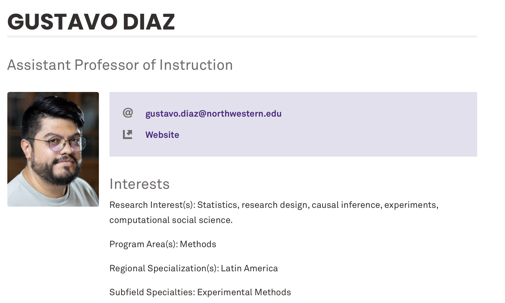

---
format:
  revealjs:
    center: true
    slide-number: false
    progress: false
    code-overflow: wrap
    theme: [default, custom.scss]
---

::: {style="text-align: center"}
##  Asking Sensitive Questions in the Social Sciences {.center .smaller}

&nbsp;

**Gustavo Diaz**  
Department of Political Science  
<gustavo.diaz@northwestern.edu>  
[gustavodiaz.org](https://gustavodiaz.org)
:::

## About me

## Why am I a political scientist? 

## About you

::: incremental
- You will be a Weinberg College major

- You will major in political science

- You will major in a social science discipline

- You plan to conduct research during undergrad

- You took AP Math/Calc/Statistics
:::

## Some questions

::: incremental
- Have you lied about being to skip class or get an extension?

- Would you bribe a police officer to avoid a traffic ticket?

- Have you used a fake ID to purchase alcohol or cigarettes?

- Do you know anyone with ties to a  terrorist organization?

- Would you oppose a black family moving next door?

- Would you allow illegal immigrants to become citizens?

:::

## What do these have in common?

::: incremental
- They are **sensitive questions**

- We can only learn about by asking directly

- But asking about them directly leads to **misreporting**

- This kind of *measurement error* is called **social desirability bias** or **sensitivity bias**
:::

## What can we do?

::: incremental
- Honestly appeals

- Confidentiality protocols

- Indirect questioning techniques

:::

## What can we do?

- Honestly appeals

- Confidentiality protocols

- **Indirect questioning techniques**

## Example

::: {.r-stack}
{.fragment width="75%" fig-align="right"}

{.fragment}
:::

::: aside
Source: [NPR](https://www.npr.org/sections/itsallpolitics/2011/11/08/142159280/mississippi-voters-reject-personhood-amendment)
:::
