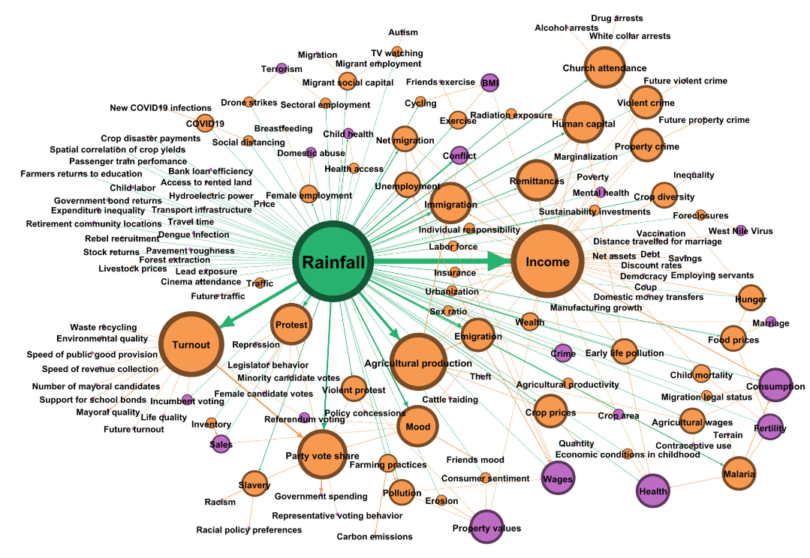
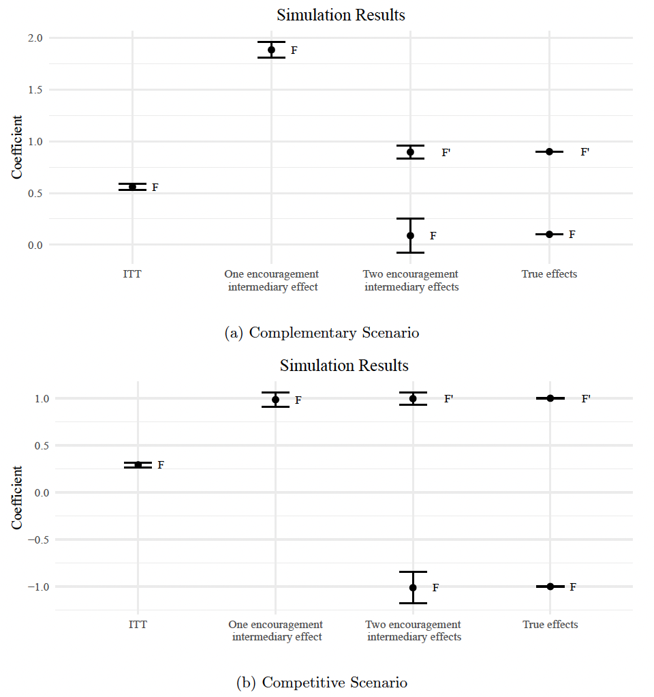

---
format:
  revealjs:
    embed-resources: true
    slide-number: false
    progress: false
    code-overflow: wrap
    theme: [default, custom.scss]
---

## Discussion: Proposals for and Applications of New Experimental Designs

- Jenke and Green. "Excludability is a Matter of Research Design: How to Conduct Credible Indirect Manipulations"

- Jordan, Ollerenshaw, Trexler. "New Evidence and Design Considerations for Repeated Measure Experiments"

::: aside
Slides: [talks.gustavodiaz.org/mpsa25_experimental](https://talks.gustavodiaz.org/mpsa25_experimental)
:::

## Common theme

{fig-align="center"}

## But the game of darts is more complicated

:::: columns
::: {.column width="50%"}

:::

::: {.column width="50%"}
{fig-align="center" width="72%" height="72%"}
:::
::::

## Jenke and Green

**Why should you care?**

::: incremental

- EVERYTHING IS AN ENCOURAGEMENT DESIGN

- EVERYTHING VIOLATES THE EXCLUSION RESTRICTION

- EVERYTHING IS SUSCEPTIBLE TO PTOVB

:::

---

{fig-align="center" width="85%"}

::: aside
**Source:** [Mellon (2024, AJPS, Figure 2)](https://doi.org/10.1111/ajps.12894)
:::

## Jenke and Green

**Why should you care?**

- EVERYTHING IS AN ENCOURAGEMENT DESIGN

- EVERYTHING VIOLATES THE EXCLUSION RESTRICTION

- EVERYTHING IS SUSCEPTIBLE TO PTOVB

. . .

**Things I like**

::: incremental
- Big picture framing

- Notation and math easy to follow

- Simulations nail the idea perfectly (cf. fig 2)
:::

---

{fig-align="center"}

## Jenke and Green

**Questions and comments**

::: incremental
- (PT)OVB is always a problem no matter what you do

- Why not (a special kind of) sensitivity analysis?

- Bias-variance trade-off on the number of $Z^{\prime}$, $F^{\prime}$?

- Placebo outcomes? (If $Z$ does not affect $Y^{\prime}$, then $Z^{\prime}$ is unlikely)

- **Clarify:** Requirement is (at least) as many $Z^{\prime}$ as $F^{\prime}$, not necessarily one per each (mismatch theory/application)
:::

## Jordan, Ollerenshaw, Trexler

**Why should you care?**

. . .

$$
SE(\widehat{ATE}) = \sqrt{\frac{\color{#4E2A84}{\text{Var}(Y_i(0)) + \text{Var}(Y_i(1)) + 2\text{Cov}(Y_i(0), Y_i(1))}}{\color{#00843D}{N-1}}}
$$


::: incremental
- Easiest way to increase statistical precision with a [larger sample size]{style="color: #00843D;"}

- But usually cost prohibitive!

- In many applications, the only way is to reduce [variance in outcomes]{style="color:#4E2A84;"} through research design
:::

## Jordan, Ollerenshaw, Trexler

**Why should you care?**

Standard experiment:

. . .

$$
\widehat{ATE} = E[Y_i(1) | Z_i = 1] - E[Y_i(0) | Z_i(0)]
$$

```{r, echo = TRUE, eval = FALSE}
lm(Y ~ Z, data = data) # or just difference in means
```

. . .

Repeated measures design (between groups):

$$
\widehat{ATE} = E[(Y_{i,t=2}(1) \color{#4E2A84}{- Y_{i,t=1}}) | Z_i = 1] - E[(Y_{i,t=2}(0) \color{#4E2A84}{- Y_{i,t=1}}) | Z_i = 0]
$$

```{r, echo = TRUE, eval = FALSE}
lm(Y_t2 ~ Z + Y_t1, data = data)
```


## Jordan, Ollerenshaw, Trexler

**Things I like**

::: incremental
- Partial replication! (replication + extension?)

- Different samples

- Thinking carefully about implementation decisions (e.g. proximity of repeated measures)

- Honesty about limitations (e.g. sensitive questions)
:::

## Jordan, Ollerenshaw, Trexler

**Questions and comments**

::: incremental

- Help the reader visualize your randomizations

- Repeating repeated measures creates attenuation bias. Why exactly? Inattention? Priming?

- Replicate/simulate more diverse studies? [(Harden et al 2019)](https://doi.org/10.1017/pan.2018.54)

- If repeated measures are just covariate adjustment, why not using [Lin's (2013)](https://doi.org/10.1214/12-AOAS583) adjustment for more precision? (s/o Ransi Clark)
:::

::: aside
Also, citation to Diaz (2025) should be [Diaz and Rossiter (2025)](https://gustavodiaz.org/files/research/precision_retention.pdf)
:::