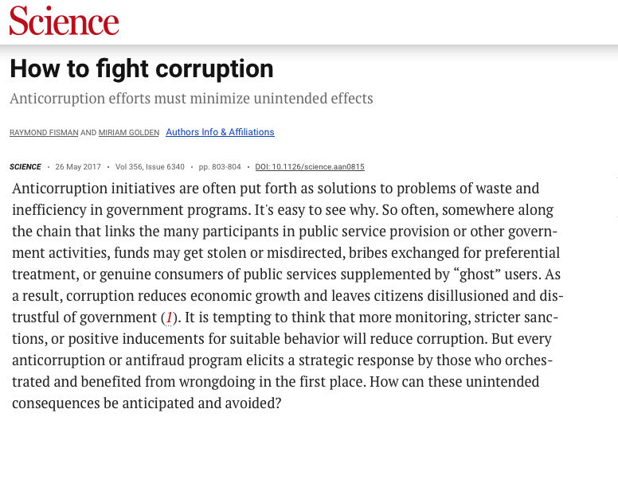
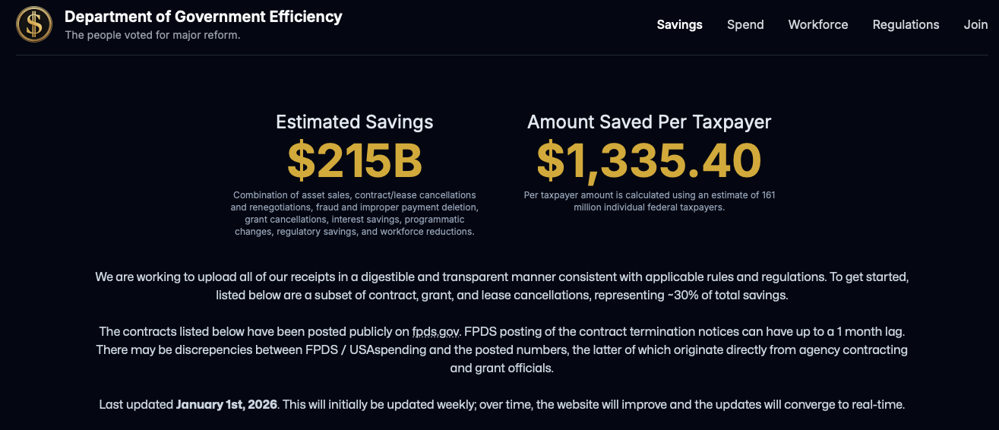
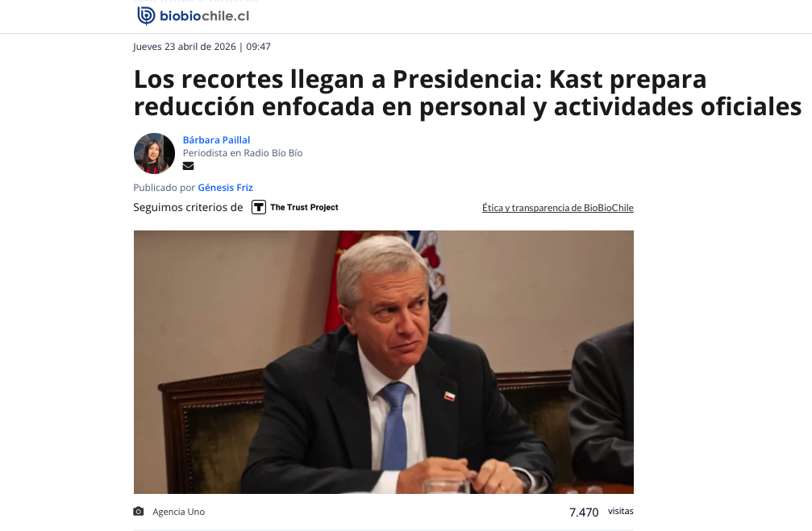
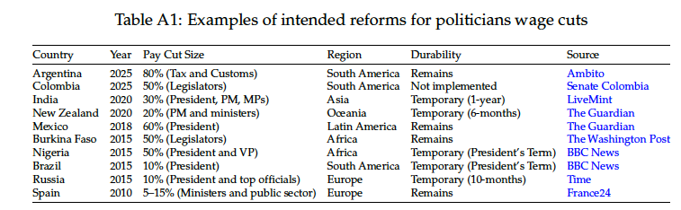
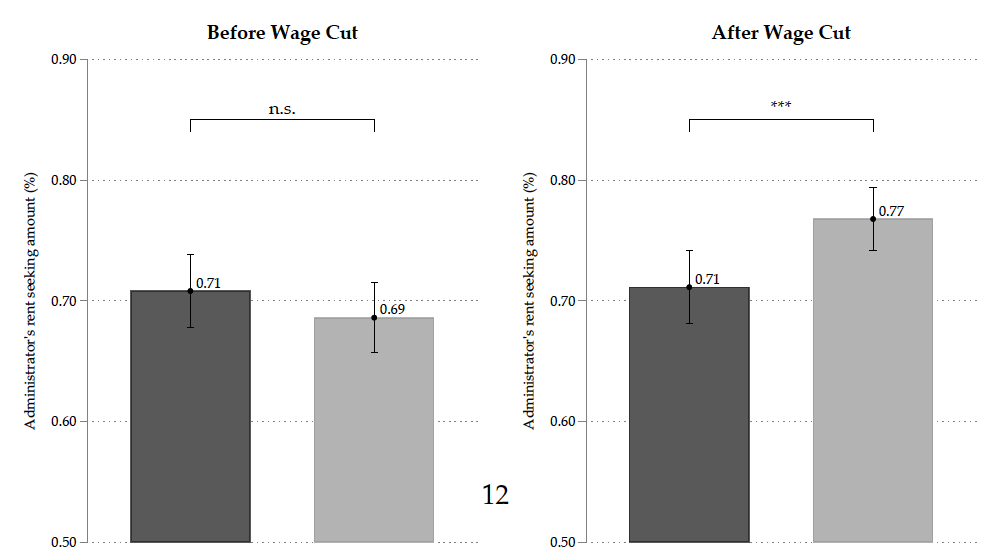
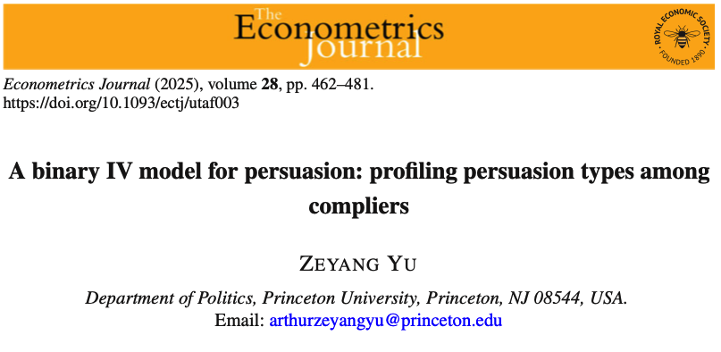

---
format:
  revealjs:
    center: true
    slide-number: false
    progress: false
    code-overflow: wrap
    theme: [default, custom.scss]
---

## Discussion: Experiments on Taxes, Corruption, and Prejudice

- Scartascini and Barinas-Forero. "Wage Cuts, Social Distributional Preferences, and Political Corruption"

- Rodrigues. "Making Sense of Shaming: A Field Experiment on Moral Disengagement and Corporate Tax Delinquency in Brazil"

::: aside
Slides: [talks.gustavodiaz.org/mpsa26_exp](https://talks.gustavodiaz.org/mpsa26_exp)
:::

## Common theme 

{fig-align="center" width=75%}

::: aside
Fisman, Raymond and Miriam Golden. 2017. ["How to fight corruption."](https://doi.org/10.1126/science.aan0815) *Science* 356 (6340)
:::

## Scartascini: Wage cut lab experiment

**Why should you care?**

. . .

- Budget cuts are a popular anti-corruption policy

---

::: aside
[doge.gov/savings](https://doge.gov/savings)
:::

---

{width=74%}

::: aside
**Source:** [biobiochile.cl](https://www.biobiochile.cl/noticias/nacional/chile/2026/04/23/los-recortes-llegan-a-presidencia-kast-prepara-reduccion-enfocada-en-personal-y-actividades-oficiales.shtml)
:::

---

## Scartascini: Wage cut lab experiment

**Why should you care?**

- Budget cuts are a popular anti-corruption policy

. . .

- **Novelty:** "Evidence on the role of wages on corruption, while holding selection constant" (p. 3)

. . .

- Even "good types" are corruptible

## Scartascini: Wage cut lab experiment

**Things I like**

::: incremental
- Tight connection with literature

- Lab experiment setup

- Large sample size

- Pre-treatment outcome baseline
:::

## Scartascini: Wage cut lab experiment

**Feedback**

Stuff a polisci reviewer may care about

::: incremental
- Why Colombia?

- External validity/ecological validity

- Why 60% wage reduction?
:::

## Scartascini: Wage cut lab experiment

**Feedback**

My own quibbles

::: incremental
- Can you extrapolate to general budget cuts?

- Efficiency factor? (p. 9)

- Section 2.3 should include experimental flow diagram

- Show **raw** p-values in figures!
:::

::: aside
I am splitting hairs because the paper at an advanced stage
:::

---

## Rodrigues: Tax delinquency field experiment

**Why should you care?**

::: incremental
- Tax evasion $\neq$ tax delinquency

- Big problem, (relatively) small intervention, potential high payoff
:::

## Rodrigues: Tax delinquency field experiment

**Things I like**

::: incremental
- Effect of shaming depends is very context dependent!
- Multi-experiment design
- Careful thinking on effect suppressors and antidotes
:::

## Rodrigues: Tax delinquency field experiment

**Feedback** 

::: incremental
- Consider adaptive design for next experiments (e.g. [Offer-Westort et al 2021 AJPS](https://doi.org/10.1111/ajps.12597))

- Can you look at payment amounts?

- ... and make statements about cost effectiveness?

- The language around mediation confused me 

- Can you estimate CATEs?

:::

## Connects with encouragement designs

1. **Control:** No postcard

2. **Civic Duty:** "DO YOUR CIVIC DUTY -- VOTE!"

3. **Hawthorne:** Civic duty message + "YOU ARE BEING STUDIED!" + explanation of how voting behavior can be examined by means of public record

4. **Neighbors:** Civic duty message + household's previous voting record in 2004 + neighbors' voting record in 2004

::: aside
Adapted from [Gerber, Green, Larimer (2004, APSR)](https://doi.org/10.1017/S000305540808009X)
:::

## So outcome is bounded

{fig-align="center" width=80%}

::: aside
[doi.org/10.1093/ectj/utaf003](https://doi.org/10.1093/ectj/utaf003)
:::

