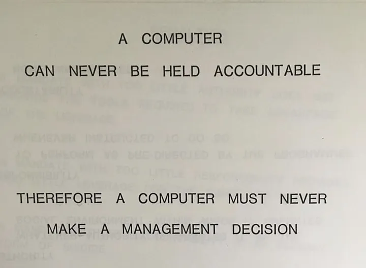
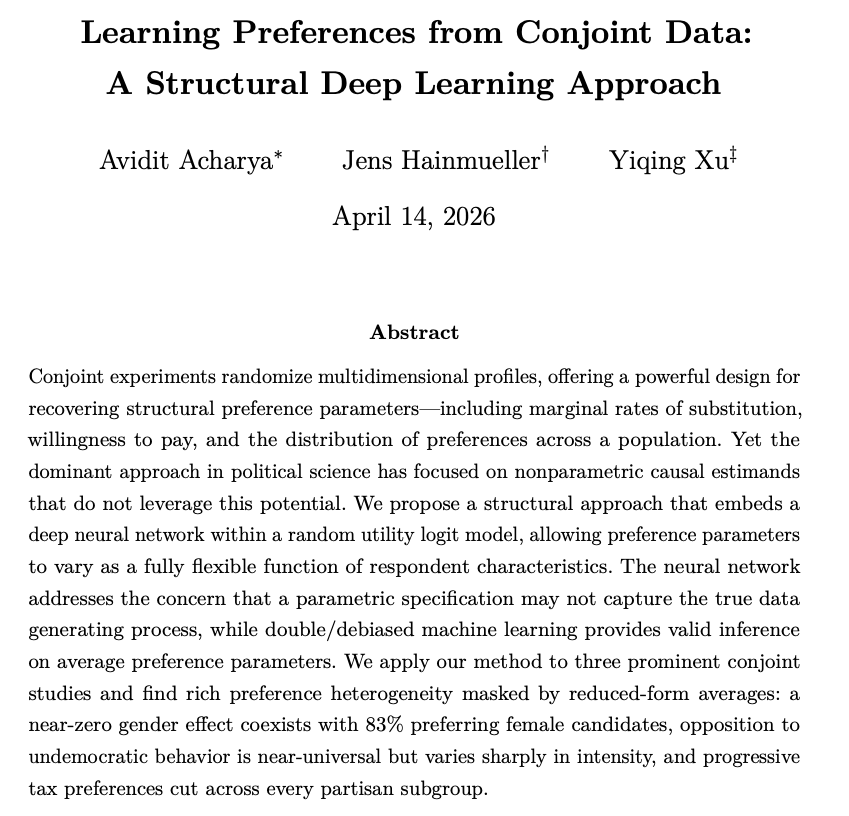

---
format:
  revealjs:
    center: true
    slide-number: false
    progress: false
    code-overflow: wrap
    theme: [default, custom.scss]
---

## Discussion: Machine Learning Applications

- Malmberg. "Investigating the Utility of LLM-Based ‘Silicon Samples’ in Political Science Conjoint Experiments"

- Sanaei, Wang, Koh. "Simulating Realistic Focus Group Discussions Using Large Language Models"

::: aside
Slides: [talks.gustavodiaz.org/mpsa26_ml](https://talks.gustavodiaz.org/mpsa26_ml)
:::

## Disclaimers

{fig-align="center"}

## Disclaimers

:::: {.columns}

::: {.column width=40%}

:::

::: {.column width=60%}

::: incremental
- AI decreases cost of prediction

- which increases the value of judgment

- **Industry:** Techbros in the board room

- **Social science:** Need to come off stronger on ethical implications and safeguards
:::

:::
::::

## Malmberg: LLM conjoints

. . .

**Why should you care?**

. . .

Experimenters *must* simulate designs before data collection

---

{fig-align="center" width=40%}

::: aside
[book.declaredesign.org](https://book.declaredesign.org)
:::

## Malmberg: LLM conjoints

**Why should you care?**

Experimenters *must* simulate designs before data collection

. . .

This is "easy" for vignette designs

. . .

But conjoints are all about multidimensional preferences

---

{fig-align="center" width=50%}

::: aside
<https://doi.org/10.48550/arXiv.2604.10845>
:::

## Malmberg: LLM conjoints

**Why should you care?**

Experimenters *must* simulate designs before data collection

This is "easy" for vignette designs

But conjoints are all about multidimensional preferences

. . .

You may want more nuanced data generation

## Malmberg: LLM conjoints

**Things I like**

::: incremental
- Large N benchmark study ([CHIP50](https://www.chip50.org), N $\approx$ 25k )

- Zero shot algorithm

- Covariate importance to understand what LLMs pay most attention to
:::

## Malmberg: LLM conjoints

**Feedback**

::: incremental
- Not enough predictive covariates?

- What is the alternative? Supervised learning?

- Would a stack of many LLMs perform better?

- **Extension:** Can we learn about hypothetical effects, new outcomes?
:::

## Sanaei et al: LLM Focus groups

<!-- important: https://www.nature.com/articles/s41586-025-10021-1 -->

**Why should you care?**

::: incremental
1. Focus groups are open-ended but expensive, need to train facilitators well

2. [Fidelity](https://doi.org/10.1017/pan.2023.2), [roleplay](https://www.nature.com/articles/s41586-023-06647-8), and [facsimile](https://www.nature.com/articles/s41586-025-10021-1) problems at the same time!

:::