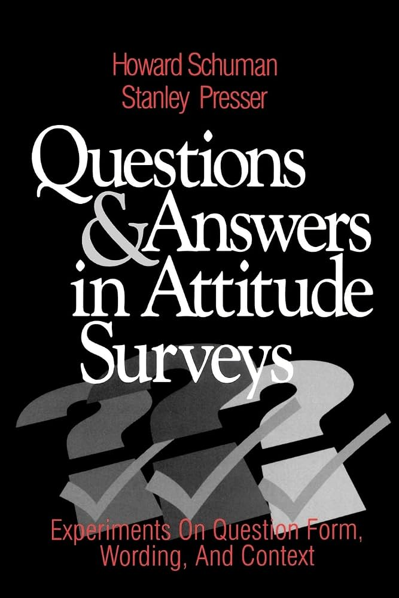

---
format:
  revealjs:
    center: true
    slide-number: false
    progress: false
    code-overflow: wrap
    theme: [default, custom.scss]
---

## Discussion: Surveys and Eye-Tracking {.smaller}

<!-- 15-20 minutes -->

- Sirotkina. "Reading Between the Eyes: Recovering (Political) Identity from Eye-Tracking Weak Signal"

- Yang. "Read It or Ignore It? A Personality-Conditioned Computational Model of Gaze Behavior in Political Advertising"

&nbsp;

::: {style="text-align: center"}
**Gustavo Diaz**  
Northwestern University  
<gustavo.diaz@northwestern.edu>  
:::

::: aside
Slides: [talks.gustavodiaz.org/polmeth26](https://talks.gustavodiaz.org/polmeth)
:::

## How these papers connect

---

{fig-align="center"}

---

Q: *What is the most important thing to teach children to prepare them for life?*

. . . 

A: **To think for themselves**

::: incremental
- 61.5% multiple choice
- 4.6% open-ended
:::

## Problem

 Gap between **self-reports** and **actual** attitudes/behaviors

. . .

**Eye-tracking solution:** Remove bias by looking at **proxies** of **actual** attitudes/behaviors

## Sirotkina: Recovering identity from eye-tracking

**Importance**

::: incremental
- **Big picture:** Weak signals abound

- Validation of novel methodology

- Eliminates bias from "self-report" gap
:::

## Sirotkina: Recovering identity from eye-tracking

**Pipeline**

1. _**Record**_  [gaze patterns and measure features]{style="color: #FFFFFF00;"}

2. _**Aggregate**_ [across images to recover signal]{style="color: #FFFFFF00;"}

3. _**Classify**_ [via supervised learning with emphasis on regularization]{style="color: #FFFFFF00;"}

[ Apply to surveys with images about immigration, Jan 6, LGBT, guns]{style="color: #FFFFFF00;"}

## Sirotkina: Recovering identity from eye-tracking

**Pipeline**

1. _**Record**_  gaze patterns and measure features
2. _**Aggregate**_ [across images to recover signal]{style="color: #FFFFFF00;"}

3. _**Classify**_ [via supervised learning with emphasis on regularization]{style="color: #FFFFFF00;"}

[ Apply to surveys with images about immigration, Jan 6, LGBT, guns]{style="color: #FFFFFF00;"}

## Sirotkina: Recovering identity from eye-tracking

**Pipeline**

1. _**Record**_  gaze patterns and measure features

2. _**Aggregate**_ across images to recover signal

3. _**Classify**_ [via supervised learning with emphasis on regularization]{style="color: #FFFFFF00;"}

[ Apply to surveys with images about immigration, Jan 6, LGBT, guns]{style="color: #FFFFFF00;"}

## Sirotkina: Recovering identity from eye-tracking

**Pipeline**

1. _**Record**_  gaze patterns and measure features

2. _**Aggregate**_ across images to recover signal

3. _**Classify**_ via supervised learning with emphasis on regularization

[ Apply to surveys with images about immigration, Jan 6, LGBT, guns]{style="color: #FFFFFF00;"}

## Sirotkina: Recovering identity from eye-tracking

**Pipeline**

1. _**Record**_  gaze patterns and measure features

2. _**Aggregate**_ across images to recover signal

3. _**Classify**_ via supervised learning with emphasis on regularization

 Apply to surveys with images about immigration, Jan 6, LGBT, guns

## Sirotkina: Recovering identity from eye-tracking

**Praise**

::: incremental
- Theory of how political identity maps into gaze

- Amazing showcase of methodological expertise!

- Proposing a *pipeline* instead of a *tool*
:::

## Sirotkina: Recovering identity from eye-tracking

**Questions**

::: incremental

- Maybe good that current pipeline is only good at capturing intensity?

- Can we build a "dictionary" of gaze patterns?

- Do we want features to be predictive of *self-reported* identity?

- How does this change downstream inference?

:::

## Yang: Gaze behavior in political advertising

**Importance**

## Yang: Gaze behavior in political advertising

**Summary**

## Yang: Gaze behavior in political advertising

**Praise**

## Yang: Gaze behavior in political advertising

**Questions**

## Questions

[Make a quarto list table with questions to prime discussion]
