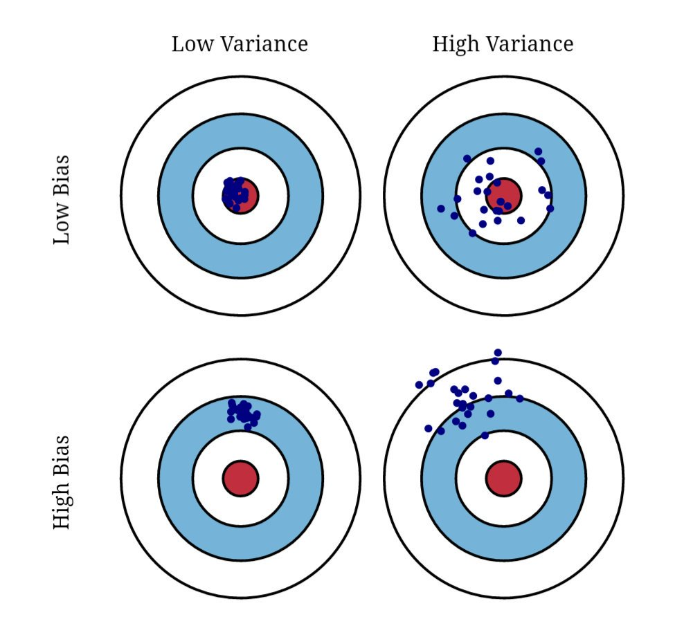
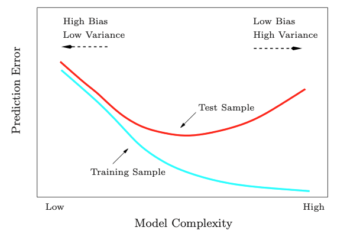
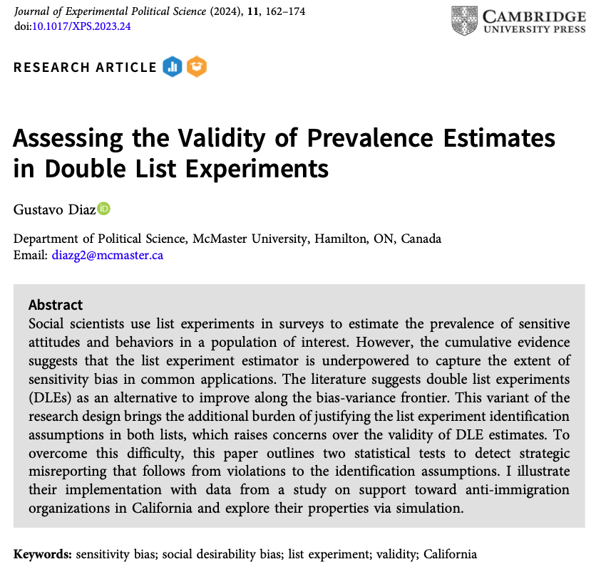

---
format:
  revealjs:
    center: true
    slide-number: false
    progress: false
    code-line-numbers: false
    theme: [default, temp.scss]
    pointer:
      pointerSize: 32
      color: '#FEC60D'
revealjs-plugins:
  - pointer
---

::: {style="text-align: center"}
##  Recovering Informative Estimates<br>in Failed Placebo-Controlled<br>List Experiments {.center .smaller}

&nbsp;

**Gustavo Diaz**  
Northwestern University  
<gustavo.diaz@northwestern.edu>  

&nbsp;


Paper y presentación: [gustavodiaz.org/puc](https://gustavodiaz.org/puc)

{.absolute bottom=0 right=-50 width="180" height="180"}

:::

```{r include=FALSE}
library(knitr)

opts_chunk$set(fig.pos = "center", echo = FALSE, 
               message = FALSE, warning = FALSE)
```

```{r setup}
# Packages
library(tidyverse)
library(DeclareDesign)
library(kableExtra)
library(tinytable)


# ggplot global options
theme_set(theme_gray(base_size = 20))

puc_blue = "#0176DE"
```

## ERC Starting Grant
**Criminal Governance in Unexpected Contexts: the Role of the Welfare State in Latin America**


- [Verónica Pérez Bentancur](https://veronicaperezbentancur.com/) (Universidad de la República)
- [Ines Fynn](https://www.inesfynn.com) (Universidad Católica del Uruguay )
- [Lucía Tiscornia](https://luciatiscornia.com) (University College Dublin)

## Puntos clave

- *Experimento de lista* en Uruguay

- *Control con placebo* arruinó resultados

- Ideas de *identificación parcial* ayudan a recuperar estimaciones informativas

## Agenda

- Diseño de experimentos de lista

- Experimento fallido

- Recuperando estimaciones informativas

# Experimentos de lista

---

 Le voy a leer cosas que a algunas personas les molestan


---

 Luego de que se las lea, dígame CUANTAS le molestan a usted


---

 No me diga CUALES, solo dígame CUANTAS

. . .

### Control

1. Que el gobierno aumente el impuesto a la bencina
2. Que los futbolistas reciban salarios millonarios
3. Que las grandes empresas contaminen el medio ambiente


---

 No me diga CUALES, solo dígame CUANTAS

### Tratamiento

1. Que el gobierno aumente el impuesto a la bencina
2. Que los futbolistas reciban salarios millonarios
3. Que las grandes empresas contaminen el medio ambiente


---

 No me diga CUALES, solo dígame CUANTAS


### Tratamiento

1. Que el gobierno suba el impuesto a la bencina
2. Que los futbolistas reciban salarios millonarios
3. Que las grandes empresas contaminen el medio ambiente
4. **Que una familia venezolana se mude a la casa de al lado**


## Reduce sesgo por sensibilidad

```{r}
# got this through
# https://automeris.io/WebPlotDigitizer/
# And by reverse engineering fig 1
# Because replication data was not available
# So this has some human error
validation = data.frame(
  technique = c("Directa", "Experimento\nde lista"),
  estimate = c(0.396, 0.487),
  upper = c(0.419, 0.562),
  lower = c(0.376, 0.417)
)

actual_vote = 0.65

ggplot(validation) +
  aes(x = technique, y = estimate) +
  geom_point(size = 4, color = puc_blue, alpha = 0) +
  geom_linerange(aes(x = technique, ymin = lower, ymax = upper),
                 color = puc_blue, linewidth = 1, alpha = 0) +
  ylim(0.2, 0.8) +
  labs(x = "Tipo de pregunta",
       y = "Proporción ítem sensible")
```


## Reduce sesgo por sensibilidad

```{r}
ggplot(validation) +
  aes(x = technique, y = estimate) +
  geom_hline(yintercept = actual_vote,
             linetype = "dashed",
             linewidth = 1) +
  geom_point(size = 4, color = puc_blue, alpha = 0) +
  geom_linerange(aes(x = technique, ymin = lower, ymax = upper),
                 color = puc_blue, linewidth = 1, alpha = 0) +
  annotate("text", x = 0.7, y = 0.7, size = 5, 
           label = "Valor real") +
  ylim(0.2, 0.8) +
  labs(x = "Tipo de pregunta", 
       y = "Proporción ítem sensible")
```


## Reduce sesgo por sensibilidad

```{r}
ggplot(validation) +
  aes(x = technique, y = estimate) +
  geom_hline(yintercept = actual_vote, 
             linetype = "dashed",
             linewidth = 1) +
  geom_point(size = 4, color = puc_blue) +
  annotate("text", x = 0.7, y = 0.7, size = 5,
           label = "Valor real") +
  ylim(0.2, 0.8) +
  labs(x = "Tipo de pregunta",
       y = "Proporción ítem sensible")
```

## Reduce sesgo por sensibilidad

```{r}
ggplot(validation) +
  aes(x = technique, y = estimate) +
  geom_hline(yintercept = actual_vote,
             linetype = "dashed",
             linewidth = 1) +
  geom_point(size = 4, color = puc_blue) +
  geom_linerange(aes(x = technique, ymin = lower, ymax = upper),
                 color = puc_blue, linewidth = 1) +
  annotate("text", x = 0.7, y = 0.7, size = 5, 
           label = "Valor real") +
  ylim(0.2, 0.8) +
  labs(x = "Tipo de pregunta", 
       y = "Proporción ítem sensible")
```

---

## ¿Y a mí, qué me importa?


---

{fig-align="center"}

---

{fig-align="center"}


## Problema

. . .

Resultados dependen de la lista base

---

{fig-align="center"}


---

::: {.list-table}

- - **Lista A**
  - **Lista B**

- - Californians for Disability
  - American Legion

- - California National<br>Organization for Women
  - Equality California
  
- - American Family Association
  - Tea Party Patriots
  
- - American Red Cross
  - Salvation Army
  
:::

. . .

**Ítem sensible:** Citizen order patrol combating undocumented immigration

---

```{r}
# Data prep
load("list/attn_rep.RData")

cali = dle

remove(dle)

# Analysis
a = cali %>% 
  split(.$experiment) %>% 
  map(~difference_in_means(listA ~ trt_A, data = .)) %>% 
  map(tidy) %>% 
  bind_rows(.id = "experiment")

b = cali %>% 
  split(.$experiment) %>% 
  map(~difference_in_means(listB ~ trt_B, data = .)) %>% 
  map(tidy) %>% 
  bind_rows(.id = "experiment")

pool = cali %>% 
  mutate(id = row_number()) %>% 
  pivot_longer(cols = c(listA, listB)) %>% 
  rename(list = name, count = value) %>% 
  mutate(Z = ifelse(trt_A == 1 & list == "listA" | trt_B == 1 & list == "listB",
                    1, 0)) %>% 
  split(.$experiment) %>% 
  map(~ lm_robust(count ~ Z + list, clusters = id, se_type = "stata", data = .)) %>% 
  map(tidy) %>% 
  bind_rows(.id = "experiment") %>% 
  filter(term == "Z")
  
est_df = rbind(a, b, pool)

est_df$term = fct_relevel(est_df$term, "trt_A", "trt_B", "Z")
```

```{r}
ggplot(est_df %>% filter(experiment == "Y" &
                           outcome != "count")) +
  aes(x = term, y = estimate, shape = term) +
  geom_hline(yintercept = 0, linetype = "dashed") + 
  geom_point(size = 4, color = puc_blue, position = position_dodge(width = 0.5), alpha = 0) +
  geom_linerange(aes(x = term, ymin = conf.low, ymax = conf.high),
                 color = puc_blue, size = 1, position = position_dodge(width = 0.5), alpha = 0) +
  theme(legend.position = "none") +
  labs(x = "Referencia", 
       y = "Proporción apoyo") +
  scale_x_discrete(labels = c("Lista A", "Lista B"))
```

::: aside
Adaptado de [Diaz (2023)](https://doi.org/10.1017/XPS.2023.24)
:::

---

```{r}
ggplot(est_df %>% filter(experiment == "Y" &
                           outcome != "count")) +
  aes(x = term, y = estimate, shape = term) +
  geom_hline(yintercept = 0, linetype = "dashed") + 
  geom_point(size = 4, color = puc_blue, position = position_dodge(width = 0.5)) +
  geom_linerange(aes(x = term, ymin = conf.low, ymax = conf.high),
                 color = puc_blue, size = 1, position = position_dodge(width = 0.5)) +
  theme(legend.position = "none") +
  labs(x = "Referencia", 
       y = "Proporción apoyo") +
  scale_x_discrete(labels = c("Lista A", "Lista B"))
```

::: aside
Adaptado de [Diaz (2023)](https://doi.org/10.1017/XPS.2023.24)
:::

## Problema


Resultados dependen de la lista base

. . .

**Origen**

. . .

1. Errores estratégicos

2. Errores no estratégicos

## Problema


Resultados dependen de la lista base

**Origen**


1. Errores estratégicos

2. **Errores no estratégicos**

## Error no estratégico

**Cosas que molestan**

```{r}
inflation = tribble(
  ~Control, ~Tratamiento,
  "Gobierno sube el impuesto a la bencina",
  "Gobierno sube el impuesto a la bencina",
  "Futbolistas reciben salarios millonarios",
  "Futbolistas reciben salarios millonarios",
  "Empresas contaminan el medio ambiente",
  "Empresas contaminan el medio ambiente",
  " ",
  "**Familia venezolana se muda al lado**"
)

inflation %>% 
  tt() %>%
  style_tt(fontsize = 0.7) %>% 
  style_tt(i = 0, bold = TRUE) %>%  
  format_tt(markdown = TRUE) 
```

. . .

&nbsp;

:::{.r-stack}
Lista tratamiendo es más larga
:::
. . .

:::{.r-stack}

:::

:::{.r-stack}
Estimación positiva de manera artificial
:::

## Error no estratégico

**Cosas que molestan**

```{r}
inflation = tribble(
  ~Control, ~Tratamiento,
  "Gobierno sube el impuesto a la bencina",
  "Gobierno sube el impuesto a la bencina",
  "Futbolistas reciben salarios millonarios",
  "Futbolistas reciben salarios millonarios",
  "Empresas contaminan el medio ambiente",
  "Empresas contaminan el medio ambiente",
  " ",
  "**Familia venezolana se muda al lado**"
)

inflation %>% 
  tt() %>%
  style_tt(fontsize = 0.7) %>% 
  style_tt(i = 0, bold = TRUE) %>%
  format_tt(markdown = TRUE)
```

**Solución:** Añadir ítem placebo

## Error no estratégico

**Cosas que molestan**

```{r}
inflation2 = tribble(
  ~Control, ~Tratamiento,
  "Gobierno sube el impuesto a la bencina",
  "Gobierno sube el impuesto a la bencina",
  "Futbolistas reciben salarios millonarios",
  "Futbolistas reciben salarios millonarios",
  "Empresas contaminan el medio ambiente",
  "Empresas contaminan el medio ambiente",
  "**Vagón del metro viene vacío**",
  "**Familia venezolana se muda al lado**"
)

inflation2 %>% 
  tt() %>%
  style_tt(i = 4, j = 1, color = puc_blue) %>% 
  style_tt(fontsize = 0.7) %>% 
  style_tt(i = 0, bold = TRUE) %>%
  format_tt(markdown = TRUE)
```

**Solución:** Añadir ítem placebo

## Placebo-controlled list experiments

. . .

**Ventaja**

Reduce sesgo por inflación artificial de manera eficiente

. . .

Sólo 5/81 estudios desde 2014 usan este diseño

## ¿Por qué?

## Mantra

. . .

Mejoras en sesgo/varianza que no comprometen la otra dimensión imponen *costos ocultos*

. . .

 Ítem placebo puede sustituir un tipo de sesgo por otro

# ¡Nos pasó a nosotros!

## Doble experimento de lista

Ha experimentado (en su barrio) en los últimos seis meses:

```{r}
list0 = tribble(
  ~`**Lista A**`, ~`**Lista B**`,
  "Vi personas haciendo deporte", "Vi personas jugando al fútbol",
  "Visité amigos el fin de semana", "Conversé con mis amigos",
  "Participé en actividades organizadas por grupos feministas", "Participé en actividades organizadas por grupos de la diversidad sexual",
  "Participé en ceremonias religiosas", "Participé en actividades solidarias en la iglesia"
)

list0 %>% 
  tt() %>%
  style_tt(fontsize = 0.7) %>% 
  format_tt(markdown = TRUE)
```

::: aside
Muestra online en Montevideo. $N = 2688$.<br>Aleatorizado en bloque por zonas policiales de riesgo.
:::

## Manipulaciones

. . .

**Ítems sensibles:** 

- Vi a miembros de bandas amenazar a vecinos
- Vi a miembros de bandas sacar a vecinos de sus casas
- Vi a miembros de bandas hacer donaciones
- Vi a miembros de bandas ofrecer trabajo

## Manipulaciones

**Ítems sensibles:** 

- **Vi a miembros de bandas amenazar a vecinos**
- [Vi a miembros de bandas sacar a vecinos de sus casas]{style="color: gray;"}
- [Vi a miembros de bandas hacer donaciones]{style="color: gray;"}
- [Vi a miembros de bandas ofrecer trabajo]{style="color: gray;"}


## Manipulaciones

**Ítem placebo:**

- No tomé mate

## Double list experiment

Ha experimentado (en su barrio) en los últimos seis meses:

```{r}
list0 %>% 
  tt() %>%
  style_tt(fontsize = 0.7) %>% 
  format_tt(markdown = TRUE)
```


## Double list experiment

Ha experimentado (en su barrio) en los últimos seis meses:

```{r}
list1 = tribble(
  ~`**Lista A**`, ~`**Lista B**`,
  "Vi personas haciendo deporte", "Vi personas jugando al fútbol",
  "Visité amigos el fin de semana", "Conversé con mis amigos",
  "Participé en actividades organizadas por grupos feministas", "Participé en actividades organizadas por grupos de la diversidad sexual",
  "Participé en ceremonias religiosas", "Participé en actividades solidarias en la iglesia",
  "**Vi a miembros de bandas amenazar a vecinos**",
  "**No tomé mate**"
)

list1 %>% 
  tt() %>% 
  style_tt(fontsize = 0.7) %>%
  format_tt(markdown = TRUE) %>% 
  style_tt(j = 2, i = 5, color = puc_blue)
```

## Double list experiment

Ha experimentado (en su barrio) en los últimos seis meses:

```{r}
list2 = tribble(
  ~`**Lista A**`, ~`**Lista B**`,
  "Vi personas haciendo deporte", "Vi personas jugando al fútbol",
  "Visité amigos el fin de semana", "Conversé con mis amigos",
  "Participé en actividades organizadas por grupos feministas", "Participé en actividades organizadas por grupos de la diversidad sexual",
  "Participé en ceremonias religiosas", "Participé en actividades solidarias en la iglesia",
  "**No tomé mate**",
  "**Vi a miembros de bandas amenazar a vecinos**"
)

list2 %>% 
  tt() %>% 
  style_tt(fontsize = 0.7) %>%
  format_tt(markdown = TRUE) %>% 
  style_tt(j = 1, i = 5, color = puc_blue)
```

## Estimadores

. . .

$$
\hat{\tau}_A = \hat E[Y_{iA }(1)] - \hat E[Y_{iA }(0)]
$$

```{r, echo=TRUE, eval=FALSE}
difference_in_means(count ~ z, subset = list == "A", data = df)
```


. . .

$$
\hat{\tau}_B = \hat E[Y_{iB }(1)] - \hat E[Y_{iB }(0)]
$$

```{r, echo=TRUE, eval=FALSE}
difference_in_means(count ~ z, subset = list == "B", data = df )
```


. . .


$$
\hat{\tau}_{Doble} = \frac{(\hat{\tau}_A + \hat{\tau}_B)}{2}
$$ 

```{r, echo = TRUE, eval=FALSE}
lm_robust(count ~ z + list, clusters = id, data = df)
```

## Resultados

```{r}
main_df = read.csv("crim_gov/main.csv")

threat_df = main_df %>% 
  filter(list_treatment == "Threatening neighbors") %>% 
  mutate(estimator = case_when(
    estimator == "Direct" ~ "Pregunta\ndirecta",
    estimator == "List A" ~ "Lista A",
    estimator == "List B" ~ "Lista B",
    estimator == "DLE" ~ "Doble"
  )) %>% 
  mutate(estimator = factor(
    estimator,
    levels = c("Pregunta\ndirecta",
               "Lista A",
               "Lista B",
               "Doble")))


ggplot(threat_df) +
  aes(x = estimator, 
      y = estimate) +
  ylim(-0.3, 0.3) +
  geom_hline(
    yintercept = 0,
    linetype = "dashed"
  ) +
  geom_point(size = 3, 
             color = puc_blue,
             alpha = 0) +
  geom_linerange(aes(
    ymin = conf.low,
    ymax = conf.high,
    x = estimator
  ),
  color = puc_blue,
  linewidth = 1,
  alpha = 0) +
  labs(
    x = "Estimador",
    y = "Proporción vio bandas\namenazando a vecinos"
  )
```


## Resultados

```{r}
ggplot(threat_df) +
  aes(x = estimator, 
      y = estimate) +
  ylim(-0.3, 0.3) +
  geom_hline(
    yintercept = 0,
    linetype = "dashed"
  ) +
  geom_point(aes(alpha = estimator == "Pregunta\ndirecta"),
             size = 3, color = puc_blue) +
  geom_linerange(aes(
    ymin = conf.low,
    ymax = conf.high,
    x = estimator,
    alpha = estimator == "Pregunta\ndirecta"
  ),
  color = puc_blue,
  linewidth = 1) +
  scale_alpha_manual(values = c(`TRUE` = 1, `FALSE` = 0), guide = "none") +
  labs(
    x = "Estimador",
    y = "Proporción vio bandas\namenazando a vecinos"
  )
```

## Resultados

```{r}
ggplot(threat_df) +
  aes(x = estimator,
      y = estimate) +
  ylim(-0.3, 0.3) +
  geom_hline(
    yintercept = 0,
    linetype = "dashed"
  ) +
  geom_point(size = 3, color = puc_blue) +
  geom_linerange(aes(
    ymin = conf.low,
    ymax = conf.high,
    x = estimator
  ),
  color = puc_blue,
  linewidth = 1) +
  labs(
    x = "Estimador",
    y = "Proporción vio bandas\namenazando a vecinos"
  )
```

## ¿Qué pasó?

. . .

[]{style="color: red;"} Prevalencia > 0

. . .

[]{style="color: red;"} Falta de atención

. . .

[]{style="color: #0176DE;"} LLama la atención

## ¿Qué hacer?

. . .

**Problema:** Estimación inválida

. . .

**Idea:** Imaginar cómo participantes habrían respondido sin el placebo

. . .

Equivalente a asumir que el estimando está *identificado parcialmente*

. . .

Permite construir **cotas no-paramétricas**

## Sharp bounds

. . .

Asumen solo datos + diseño experimental (SUTVA)

. . .

**Implica:** Cambio solo en respuestas de control

. . .

**Sharp bounds:** Imputar valor mínimo/máximo posible

::: aside
**En español:** Cotas óptimas, estrechas, o ajustadas. **Economía:** *Manski bounds*
:::

## No informa

```{r}
bounds_df = read.csv("crim_gov/bounds.csv")

std = bounds_df %>%
  filter(list_treatment == "Threaten" &
           Assumptions == "Standard") %>%
  mutate(Estimator = case_when(
    Estimator == "Single list" &
      list == "count_a" ~ "Lista A",
    Estimator == "Single list" &
      list == "count_b" ~ "Lista B",
    Estimator == "DLE" ~ "Doble",
    .default = Estimator
  ))  %>%
  mutate(Estimator = factor(
    Estimator,
    levels = c(
      "Lista A",
      "Lista B",
      "Doble"
    )
  )) %>% 
  select(
    Estimator,
    outcome,
    estimate,
    boot_ci_which
  ) %>%
  pivot_wider(
    names_from = outcome,
    values_from = c(estimate, boot_ci_which)
  )

ggplot(std) +
  aes(x = Estimator,
      y = estimate_count_hi) +
  geom_hline(yintercept = 0,
             linetype = "dashed") +
  geom_linerange(aes(
    x = Estimator,
    ymin = estimate_count_lo,
    ymax = estimate_count_hi
  ), color = puc_blue,
  linewidth = 3,
  alpha = 0) +
  geom_linerange(aes(
    x = Estimator,
    ymin = boot_ci_which_count_lo,
    ymax = boot_ci_which_count_hi
  ), color = puc_blue,
  linewidth = 1,
  alpha = 0) +
  labs(y = "Proporción vio bandas\namenazando a vecinos",
       x = "Estimador")

```

## No informa

```{r}
ggplot(std) +
  aes(x = Estimator,
      y = estimate_count_hi) +
  geom_hline(yintercept = 0,
             linetype = "dashed") +
  geom_linerange(aes(
    x = Estimator,
    ymin = estimate_count_lo,
    ymax = estimate_count_hi
  ), color = puc_blue,
  linewidth = 3) +
  geom_linerange(aes(
    x = Estimator,
    ymin = boot_ci_which_count_lo,
    ymax = boot_ci_which_count_hi
  ), color = puc_blue,
  linewidth = 1) +
  labs(y = "Proporción vio bandas\namenazando a vecinos",
       x = "Estimador")

```

## Refinamiento 1

. . .

**Supuestos de experimentos de lista**

::: incremental
1. *No liars:* Participante no cuenta el ítem sensible si no aplica

2. *No design effects:* Añadir/remover ítem sensible no cambia la cuenta de la lista base
:::

. . .

**Implica:**

::: incremental
- Cambio solo en respuestas de control
- ... por una unidad
:::

## Cotas con supuestos adicionales

**Implica:**

- Cambio solo en respuestas de control
- ... por una unidad

. . .

**Cota inferior:** Respuestas de 5 se vuelven 4

. . .

**Cota superior:** Respuestas de control -1 (truncado en 0)

## ¿Mejor?

```{r}
le = bounds_df %>% 
  filter(list_treatment == "Threaten" &
           Assumptions == "List") %>% 
  mutate(Estimator = case_when(
    Estimator == "Single list" &
      list == "count_a" ~ "Lista A",
    Estimator == "Single list" &
      list == "count_b" ~ "Lista B",
    Estimator == "DLE" ~ "Doble",
    .default = Estimator
  )) %>% 
  mutate(Estimator = factor(
    Estimator,
    levels = c(
      "Lista A",
      "Lista B",
      "Doble"
    )
  )) %>% 
# the boot CIs are backwards
  mutate(boot_ci_which = ifelse(
    outcome == "count_hi",
    boot_ci_hi,
    boot_ci_lo
  )) %>% 
    select(
    Estimator, 
    outcome,
    estimate,
    boot_ci_which
  ) %>% 
  pivot_wider(
    names_from = outcome,
    values_from = c(estimate, boot_ci_which)
  )

ggplot(le) +
  aes(x = Estimator,
      y = estimate_count_hi) +
  geom_hline(yintercept = 0,
             linetype = "dashed") +
  geom_linerange(aes(
    x = Estimator,
    ymin = estimate_count_lo,
    ymax = estimate_count_hi
  ), color = puc_blue,
  linewidth = 3) +
  geom_linerange(aes(
    x = Estimator,
    ymin = boot_ci_which_count_lo,
    ymax = boot_ci_which_count_hi
  ), color = puc_blue,
  linewidth = 1) +
  labs(y = "Proporción vio bandas\namenazando a vecinos",
       x = "Estimador") +
  ylim(-0.2, 1.2)
```

## Información auxiliar

Cota inferior es conservativa

. . .

Cota superior es *demasiado agresiva* porque asume todos habrían cambiado su respuesta

. . . 

Podríamos mejorar si supieramos:

- A quién aplica el placebo en la cuesta
- Proporción a nivel agregado

## Refinamiento 2

**Incorporar información auxiliar sobre placebo**

. . .

**Cota inferior:** Respuestas de 5 se vuelven 4

. . .

**Cota superior:** 

$$
\hat \tau_{H} = (1- \delta) \times \bar V_{obs} + \delta \times \bar V_{max}
$$

$\delta$: Proporción placebo auxiliar

$\bar V_{obs}$: Estimación con datos observados

$\bar V_{max}$: Estimación asumiendo todas las respuestas disminuyen

---

No tenemos información sobre el placebo 

. . .

¡Pero podemos simular!

## Simulando proporción placebo

```{r}
bounds_known_prop = read.csv("crim_gov/bounds_known_prop.csv")

# I messed up the proportion labels
bkp_hi = bounds_known_prop %>% 
  filter(list_treatment == "Threaten") %>% 
  mutate(p = case_when(
    p == 1 ~ 0.05,
    p == 2 ~ 0.1,
    p == 3 ~ 0.2,
    p == 4 ~ 0.3
  ),
  estimator = case_when(
    estimator == "List" &
      list == "count_a" ~ "Lista A",
    estimator == "List" &
      list == "count_b" ~ "Lista B",
    estimator == "DLE" ~ "Doble",
    .default = estimator
  )) %>% 
  mutate(estimator = factor(
    estimator,
    levels = c(
      "Lista A",
      "Lista B",
      "Doble"
    )
  )) %>%
  select(
    p, estimator, 
    estimate_hi = estimate,
    boot_ci_hi,
  )

bkp_lo = le %>% select(
  estimator = Estimator,
  estimate_lo = estimate_count_lo,
  boot_ci_lo = boot_ci_which_count_lo
)

bkp = left_join(bkp_hi, bkp_lo, by = "estimator")

ggplot(bkp) +
    aes(x = estimator,
      y = estimate_hi,
      color = factor(p)) +
  geom_hline(yintercept = 0,
             linetype = "dashed") +
  geom_linerange(aes(
    x = estimator,
    ymin = estimate_lo,
    ymax = estimate_hi
  ), linewidth = 3,
  position = position_dodge(width = 0.5)) +
  geom_linerange(aes(
    x = estimator,
    ymin = boot_ci_lo,
    ymax = boot_ci_hi
  ),  linewidth = 1,
  position = position_dodge(width = 0.5)) +
  scale_color_viridis_d() +
  labs(y = "Proporción vio bandas\namenazando a vecinos",
       x = "Estimador",
       color = "Proporción placebo") +
  theme(legend.position = "bottom") +
  ylim(-0.2, 1.2)
```

## Paper

::: incremental
- **Refinamiento 3:** Incorporar preguntas directas sobre ítem sensible

- **Validación:** Signos zodiacales en China
:::

## Conclusión

- Método basado en diseño para recuperar estimaciones informatives en experimentos de lista cuando el control con placebo falla

- Basado en situación *extrema*

- Herramienta para justificar diseño de lista

- Reflejo de cómo usar propiedades estadísticas para informar diseño de investigación

- ¡Hacer preguntas directas de todo!

## ¡Gracias!

**Contacto:** <gustavo.diaz@northwestern.edu>

**Información adicional:** [gustavodiaz.org/puc](https://gustavodiaz.org/puc)


{.absolute bottom=0 right=-50 width="180" height="180"}