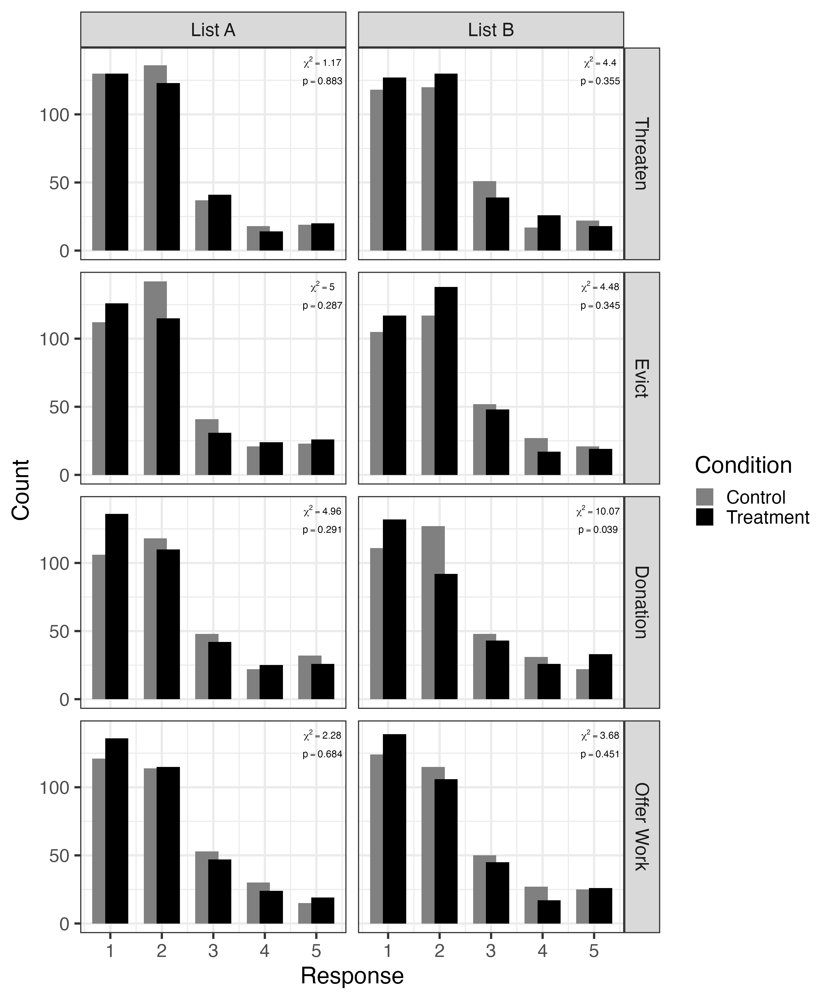
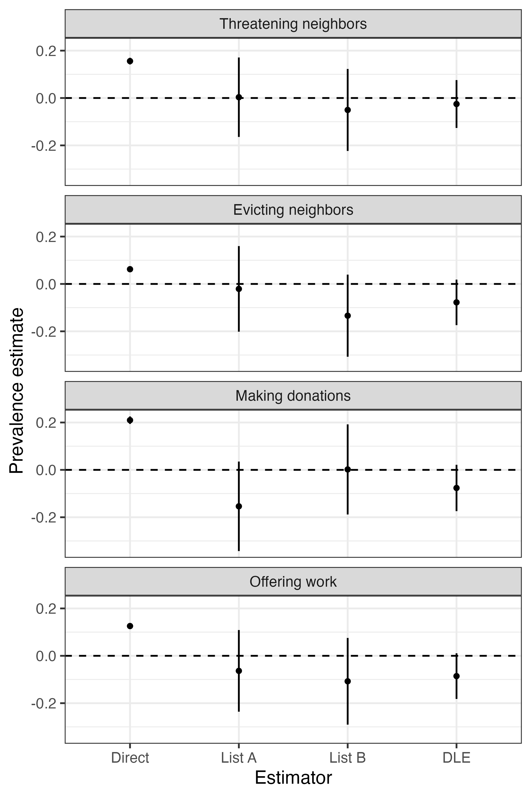
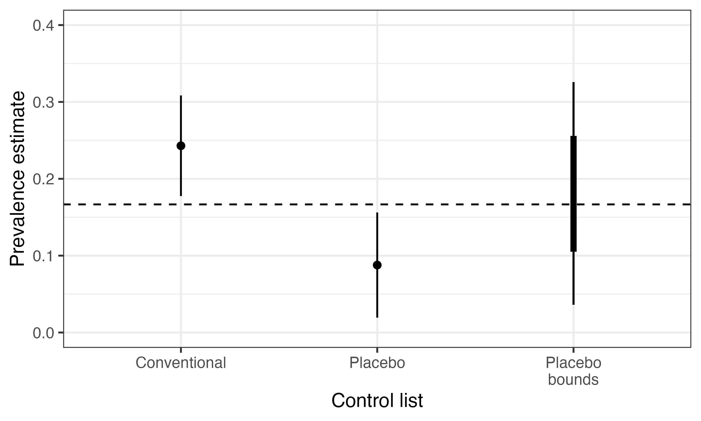

```{r include=FALSE}
library(knitr)

opts_chunk$set(fig.pos = "center", echo = FALSE, 
               message = FALSE, warning = FALSE)
```

```{r setup}
# Packages
library(tidyverse)
library(DeclareDesign)
library(kableExtra)
library(tinytable)
library(modelsummary)


# ggplot global options
theme_set(theme_gray(base_size = 20))

puc_blue = "#0176DE"
```

# Additional information and results

## Sample sizes by experimental condition

```{r}
design_tab = read.csv("list_placebo/design_tab.csv")

colnames(design_tab) = c(
  "X",
  "Sensitive",
  "Placebo",
  "Threaten",
  "Evict",
  "Donation",
  "Work"
)

design_tab[, -1] %>% 
  tt() %>% 
  group_tt(
    j = list(
      "Item location" = 1:2,
      "Sensitive item" = 3:6
    )
  )
```


## Sample characteristics

```{r}
desc_tab = read.csv("list_placebo/descriptive.csv")

desc = desc_tab %>%
  rename(Variable = variable) %>%
  mutate(Variable = case_when(
    Variable == "age" ~ "Age (years)",
    # sex
    Variable == "female" ~ "Female",
    Variable == "male" ~ "Male",
    Variable == "other_sex" ~ "Other sex",
    # education
    Variable == "edu_pri_inc" ~ "Primary incomplete",
    Variable == "edu_pri_com" ~ "Primary complete",
    Variable == "edu_sec_inc" ~ "Secondary incomplete",
    Variable == "edu_sec_com" ~ "Secondary complete",
    Variable == "edu_ter_inc" ~ "Tertiary incomplete",
    Variable == "edu_ter_com" ~ "Tertiary complete",
    # race
    Variable == "white" ~ "White",
    Variable == "afro" ~ "Afro-descendant",
    Variable == "indigenous" ~ "Indigenous",
    Variable == "other_race" ~ "Other race",
    # employment
    Variable == "employed" ~ "Worked last week",
    # income
    Variable == "inc_great_diff" ~ "Not enough, faces great difficulties",
    Variable == "inc_diff" ~ "Not enough, faces some difficulty",
    Variable == "inc_enough" ~ "Enough to make ends meet",
    Variable == "inc_save" ~ "Enough to save",
    .default = NA
  )) %>%
  mutate(Variable = factor(Variable,
                           levels = c(
                             "Age (years)",
                             # sex
                             "Female",
                             "Male",
                             "Other sex",
                             # education
                             "Primary incomplete",
                             "Primary complete",
                             "Secondary incomplete",
                             "Secondary complete",
                             "Tertiary incomplete",
                             "Tertiary complete",
                             # race
                             "White",
                             "Afro-descendant",
                             "Indigenous",
                             "Other race",
                             # employment
                             "Worked last week",
                             # income
                             "Not enough, faces great difficulties",
                             "Not enough, faces some difficulty",
                             "Enough to make ends meet",
                             "Enough to save"
                           ))) %>% 
  select(-X)

desc %>%
  arrange(Variable) %>%
  tt(
    digits = 3
  ) %>% 
  format_tt(j = 3:6, digits = 3, num_fmt = "decimal", num_zero = TRUE) %>% 
  format_tt(markdown = TRUE) %>% 
  group_tt(
    i = list(
      "_Sex_" = 2,
      "_Education_" = 5,
      "_Race_" = 11,
      "_Employment_" = 15,
      "_Income_" = 16
    )
  ) %>% 
  style_tt(i = "~groupi", indent = 1) 

```

## Observed responses



## Results with all items



## Bounds with all items

```{r}
#| fig-width: 8
#| fig-height: 10

bnds = read.csv("list_placebo/bounds.csv")

bd = bnds %>% 
  mutate(Estimator = case_when(
    Estimator == "Single list" &
      list == "count_a" ~ "List A",
    Estimator == "Single list" &
      list == "count_b" ~ "List B",
    Estimator == "DLE" ~ "Pooled",
    .default = Estimator
  )) %>% 
  mutate(boot_ci_which = case_when(
    outcome == "count_hi" & 
      Assumptions == "List" ~ boot_ci_hi,
    outcome == "count_lo" &
      Assumptions == "List" ~ boot_ci_lo,
    .default = boot_ci_which
  )) %>% 
  select(
    Assumptions,
    Estimator, 
    list_treatment,
    outcome,
    estimate,
    boot_ci_which
  ) %>% 
  pivot_wider(
    names_from = outcome,
    values_from = c(estimate, boot_ci_which)
  )


ggplot(bd) +
  aes(x = Assumptions,
      y = estimate_count_hi,
      color = Estimator) +
  geom_hline(yintercept = 0,
             linetype = "dashed") +
  geom_linerange(aes(
    x = rev(Assumptions),
    ymin = estimate_count_lo,
    ymax = estimate_count_hi
  ), linewidth = 3,
  position = position_dodge(width = 0.5)) +
  geom_linerange(aes(
    x = rev(Assumptions),
    ymin = boot_ci_which_count_lo,
    ymax = boot_ci_which_count_hi
  ), linewidth = 1,
  position = position_dodge(width = 0.5)) +
  facet_wrap(~list_treatment, ncol = 1) +
  scale_color_grey(start = 0.8, end = 0) +
  labs(x = "Type of bounds",
       y = "Prevalence") +
  coord_cartesian(ylim = c(-1, 1)) +
  scale_x_discrete(
    labels = c(
      "Sharp", 
      "List experiment\nassumptions"))
```

## Known placebo proportion bounds

```{r}
# bounds_known_prop.csv
bounds_known_prop = read.csv("list_placebo/bounds_known_prop.csv")

# I messed up the proportion labels
bkp_hi = bounds_known_prop %>% 
  mutate(p = case_when(
    p == 1 ~ 0.05,
    p == 2 ~ 0.1,
    p == 3 ~ 0.2,
    p == 4 ~ 0.3
  ),
  estimator = case_when(
    estimator == "List" &
      list == "count_a" ~ "List A",
    estimator == "List" &
      list == "count_b" ~ "List B",
    estimator == "DLE" ~ "Pooled",
    .default = estimator
  )) %>% 
  select(
    p, list_treatment, estimator, 
    estimate_hi = estimate,
    boot_ci_hi,
  )


le = bnds %>% 
  filter(Assumptions == "List") %>% 
  mutate(Estimator = case_when(
    Estimator == "Single list" &
      list == "count_a" ~ "List A",
    Estimator == "Single list" &
      list == "count_b" ~ "List B",
    Estimator == "DLE" ~ "Pooled",
    .default = Estimator
  )) %>% 
# the boot CIs are backwards
  mutate(boot_ci_which = ifelse(
    outcome == "count_hi",
    boot_ci_hi,
    boot_ci_lo
  )) %>% 
    select(
    list_treatment,
    Estimator, 
    outcome,
    estimate,
    boot_ci_which
  ) %>% 
  pivot_wider(
    names_from = outcome,
    values_from = c(estimate, boot_ci_which)
  )

bkp_lo = le %>% select(
  list_treatment,
  estimator = Estimator,
  estimate_lo = estimate_count_lo,
  boot_ci_lo = boot_ci_which_count_lo
)

bkp = left_join(bkp_hi, bkp_lo, by = c("list_treatment", "estimator"))
```

```{r}
#| fig-width: 8
#| fig-height: 10


ggplot(bkp) +
    aes(x = estimator,
      y = estimate_hi,
      color = factor(p)) +
  geom_hline(yintercept = 0,
             linetype = "dashed") +
  geom_linerange(aes(
    x = estimator,
    ymin = estimate_lo,
    ymax = estimate_hi
  ), linewidth = 3,
  position = position_dodge(width = 0.5)) +
  geom_linerange(aes(
    x = estimator,
    ymin = boot_ci_lo,
    ymax = boot_ci_hi
  ),  linewidth = 1,
  position = position_dodge(width = 0.5)) +
  facet_wrap(~list_treatment, ncol = 1) +
  scale_color_grey(start = 0.8, end = 0) +
  labs(
    y = "Prevalence",
    x = "Estimator",
    color = "Proportion\nholding\nplacebo"
  )
  
```

## Bounds with direct questions

```{r}
bnds_direct = read.csv("list_placebo/bounds_direct.csv")

# We only want the List assumptions
bdd = bnds_direct %>% 
  mutate(Assumptions = "+ Combined\nestimator") %>% 
  mutate(Estimator = case_when(
    Estimator == "Single list" &
      list == "count_a" ~ "List A",
    Estimator == "Single list" &
      list == "count_b" ~ "List B",
    Estimator == "DLE" ~ "Pooled",
    .default = Estimator
  )) %>% 
  mutate(boot_ci_which = case_when(
    outcome == "count_hi" & 
      Assumptions == "List" ~ boot_ci_hi,
    outcome == "count_lo" &
      Assumptions == "List" ~ boot_ci_lo,
    .default = boot_ci_which
  )) %>% 
  select(
    Assumptions,
    Estimator, 
    list_treatment,
    outcome,
    estimate,
    boot_ci_which
  ) %>% 
  pivot_wider(
    names_from = outcome,
    values_from = c(estimate, boot_ci_which)
  )

bdd_df = bind_rows(
  bd %>% filter(Assumptions == "List"),
  bdd
)
```

```{r}
#| fig-width: 8
#| fig-height: 10

bdd_df$Assumptions = fct_rev(bdd_df$Assumptions)

ggplot(bdd_df) +
  aes(x = Estimator,
      y = estimate_count_hi, 
      color = Assumptions) +
  geom_hline(yintercept = 0,
             linetype = "dashed") +
  geom_linerange(aes(
    x = Estimator,
    ymin = estimate_count_lo,
    ymax = estimate_count_hi
  ), linewidth = 3,
  position = position_dodge(width = 0.5)) +
  geom_linerange(aes(
    x = Estimator,
    ymin = boot_ci_which_count_lo,
    ymax = boot_ci_which_count_hi
  ), linewidth = 1,
  position = position_dodge(width = 0.5)) +
  facet_wrap(~list_treatment, ncol = 1) +
  scale_color_grey(start = 0.8, end = 0) +
  labs(y = "Prevalence",
       color = "Bounds")
```

# Statistical tests

## Positive placebo responses

```{r}
p = read.csv("list_placebo/placebo_tests.csv")

aronow = p %>% 
  filter(test == "beta") %>% 
  mutate(
    list = case_when(
      list == "count_a" ~ "A",
      list == "count_b" ~ "B",
      list == "double" ~ "Double",
      .default = list
    )
  ) %>% 
  rename(
    List = list,
    Item = list_treatment,
    Statistic = estimate,
    `p-value` = p.value
  ) %>% 
  mutate(
    Item = case_when(
      Item == "Threaten" ~ "Threatening neighbors",
      Item == "Evict" ~ "Evicting neighbors",
      Item == "Donation" ~ "Making donations",
      Item == "Offer Work" ~ "Offering work"
    )
    )%>%
      mutate(
        Item = factor(
          Item,
          levels = c(
            "Threatening neighbors",
            "Evicting neighbors",
            "Making donations",
            "Offering work"
          ))) %>%
  arrange(List, Item) %>%
  select(Item, Statistic, `p-value`, n)

aronow %>%
  tt(
    digits = 3,
    notes = "**Note:** Statistic represents prevalence estimate among those who admit to sensitive item in direct question. p-values drawn from a model that includes block fixed-effects and clustered standard errors by respondent, testing the hypothesis of Statistic = 1.") %>%
  format_tt(j = 2:3, digits = 3, num_fmt = "decimal", num_zero = TRUE) %>%
  format_tt(markdown = TRUE) %>% 
  group_tt(
    i = list(
      "_List A_" = 1,
      "_List B_" = 5,
      "_Double_" = 9
    )
  ) %>% 
  style_tt(i = "~groupi", indent = 1) 
```

## Attention check failed response

```{r}
att = read.csv("list_placebo/attention_test.csv")

att_tab = att %>% 
  filter(term == "Z:attention") %>% 
  mutate(
    list = case_when(
      list == "count_a" ~ "List A",
      list == "count_b" ~ "List B",
      .default = "Double"
    )
  ) %>% 
  rename(
    List = list,
    Item = list_treatment,
    Estimate = estimate,
    SE = std.error,
    `p-value` = p.value
  ) %>% 
  mutate(
    Item = case_when(
      Item == "Threaten" ~ "Threatening neighbors",
      Item == "Evict" ~ "Evicting neighbors",
      Item == "Donation" ~ "Making donations",
      Item == "Offer Work" ~ "Offering work"
    )
    )%>%
      mutate(
        Item = factor(
          Item,
          levels = c(
            "Threatening neighbors",
            "Evicting neighbors",
            "Making donations",
            "Offering work"
          ))) %>%
  arrange(List, Item) %>% 
  select(Item, Estimate, SE, `p-value`)

att_tab %>% 
  tt(
    digits = 3,
    notes = "**Note:** Estimates represent the regression coefficient for the interaction between a binary indicator denoting whether the respondent failed the attention check and the sensitive item placement indicator. Drawn from OLS regression models with block fixed effects and HC2 robust standard errors (for List A and) and clustered standard errors by respondent (for the Double list experiment).") %>%
  format_tt(j = 2:3, digits = 3, num_fmt = "decimal", num_zero = TRUE) %>%
  format_tt(markdown = TRUE) %>% 
  group_tt(
    i = list(
      "_List A_" = 1,
      "_List B_" = 5,
      "_Double_" = 9
    )
  ) %>% 
  style_tt(i = "~groupi", indent = 1) 
```


## Attention check raw response

```{r}
att_check = read.csv("list_placebo/attention_check.csv")

att_check_tab = att_check %>%
  filter(term == "Z:attention_check") %>%
  mutate(
    list = case_when(
      list == "count_a" ~ "List A",
      list == "count_b" ~ "List B",
      .default = "Double"
    )
  ) %>%
  rename(
    List = list,
    Item = list_treatment,
    Estimate = estimate,
    SE = std.error,
    `p-value` = p.value
  ) %>%
  mutate(
    Item = case_when(
      Item == "Threaten" ~ "Threatening neighbors",
      Item == "Evict" ~ "Evicting neighbors",
      Item == "Donation" ~ "Making donations",
      Item == "Offer Work" ~ "Offering work"
    )
  ) %>%
  mutate(
    Item = factor(
      Item,
      levels = c(
        "Threatening neighbors",
        "Evicting neighbors",
        "Making donations",
        "Offering work"
      ))) %>%
  arrange(List, Item) %>%
  select(Item, Estimate, SE, `p-value`)

att_check_tab %>%
  tt(
    digits = 3,
    notes = "**Note:** Estimates represent the regression coefficient for the interaction between the raw mock vignette response and the sensitive item placement indicator. Drawn from OLS regression models with block fixed effects and HC2 robust standard errors (for List A and List B) and clustered standard errors by respondent (for the Double list experiment).") %>%
  format_tt(j = 2:3, digits = 3, num_fmt = "decimal", num_zero = TRUE) %>%
  format_tt(markdown = TRUE) %>%
  group_tt(
    i = list(
      "_List A_" = 1,
      "_List B_" = 5,
      "_Double_" = 9
    )
  ) %>%
  style_tt(i = "~groupi", indent = 1)
```

## Attention check distance from correct recall

```{r}
recall = read.csv("list_placebo/recall.csv")

recall_tab = recall %>%
  filter(term == "Z:recall") %>%
  mutate(
    list = case_when(
      list == "count_a" ~ "List A",
      list == "count_b" ~ "List B",
      .default = "Double"
    )
  ) %>%
  rename(
    List = list,
    Item = list_treatment,
    Estimate = estimate,
    SE = std.error,
    `p-value` = p.value
  ) %>%
  mutate(
    Item = case_when(
      Item == "Threaten" ~ "Threatening neighbors",
      Item == "Evict" ~ "Evicting neighbors",
      Item == "Donation" ~ "Making donations",
      Item == "Offer Work" ~ "Offering work"
    )
  ) %>%
  mutate(
    Item = factor(
      Item,
      levels = c(
        "Threatening neighbors",
        "Evicting neighbors",
        "Making donations",
        "Offering work"
      ))) %>%
  arrange(List, Item) %>%
  select(Item, Estimate, SE, `p-value`)

recall_tab %>%
  tt(
    digits = 3,
    notes = "**Note:** Estimates represent the regression coefficient for the interaction between the distance from the correct answer on recalling the number of items on the mock vignette and the sensitive item placement indicator. Drawn from OLS regression models with block fixed effects and HC2 robust standard errors (for List A and List B) and clustered standard errors by respondent (for the Double list experiment).") %>%
  format_tt(j = 2:3, digits = 3, num_fmt = "decimal", num_zero = TRUE) %>%
  format_tt(markdown = TRUE) %>%
  group_tt(
    i = list(
      "_List A_" = 1,
      "_List B_" = 5,
      "_Double_" = 9
    )
  ) %>%
  style_tt(i = "~groupi", indent = 1)
```

## Mock vignette responses and time spent on list experiment questions

```{r}
load("list_placebo/timer.rda")

modelsummary(
  list(
    "Attention check" = timer_mod,
    "Raw response" = timer_mod_2
  ),
  coef_rename = c(
    "(Intercept)"     = "Intercept",
    "attention"       = "Failed attention check",
    "attention_check" = "Raw response"
  ),
  gof_map = c("nobs", "r.squared"),
  notes = "\\textbf{Note:} OLS regression models with HC2 robust standard errors. Outcome is total time spent on both list experiment questions (in seconds).",
  stars = c("*" = .05),
  output = "latex",
  escape = FALSE
  )
  
```

# Validation study [(Agerberg 2021)](https://doi.org/10.1177/20531680211013154)

## Design

**Survey:** Online list experiment on a sample of $4,973$ participants in China via Lucid.

**Prompt:** How many items apply

**Baseline:** 

- The government is the employee of the people and should do as the people wish.
- The government is like a parent and should tell the people what to do.
- I live in the same city where I was born.
- Generally speaking, most people cannot be trusted.

**Treatment:**

- I was born in the year of [BLANK] or the year of [BLANK] (filled so that prevalence is known to be 1/6).

**Placebo:**

- I was born in the 2000s or 1970s (Made impossible by previously declared age)


## Results



