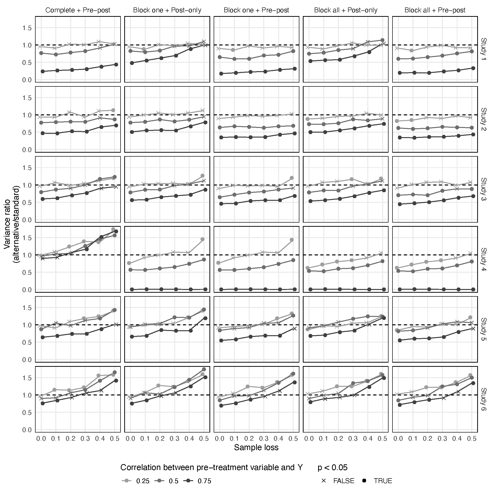
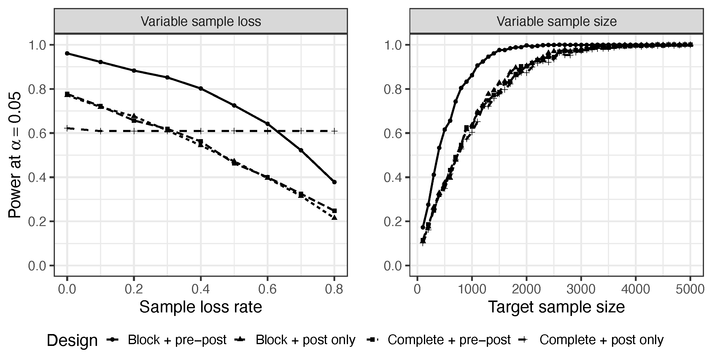
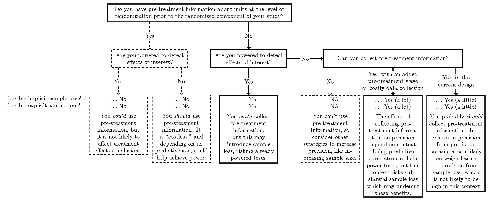

```{r include=FALSE}
library(knitr)

opts_chunk$set(fig.align = "center",
               echo = FALSE, 
               message = FALSE, 
               warning = FALSE)
```

```{r setup}
# Packages
library(tidyverse)
library(haven)
library(DeclareDesign)
library(tinytable)
library(kableExtra)
library(dagitty) # make DAGs
library(ggdag) # Plot DAGs
library(gridExtra) # Paste plots side by side


# ggplot global options
theme_set(theme_gray(base_size = 25))
ggdodge = position_dodge(width = 0.5)

# color
tulane = "#006747"
```

# Block randomization

## Illustration

{fig-align="center"}

## Estimator

$$\widehat{ATE}_{\text{Block}} = \sum_{b=1}^B \frac{n_b}{N} \widehat{ATE}_b$$

## Code

```{r, echo = TRUE, eval = FALSE}
# Standard design
lm(Y ~ Z, 
   data = data)

# Block randomized
lm(Y ~ Z + block, 
   data = data)
```

# Current use

Based on 2022-23 articles published in APSR, AJPS, JOP, PB, CPS, JEPS.

```{r}
journals2 = tribble(
  ~` `, ~N, ~`%`,
  "Pre-post", 10, "5%",
  "Blocking", 16, "7%",
  "Both", 6, "3%",
  "Mention covariates", 169, "78%",
  "Nothing", 15, "7%" 
)

journals2 %>% 
  tt() %>% 
  group_tt(i = list(
    "Neither" = 4
  )) %>% 
  style_tt(fontsize = 0.9)

```

# Full replication results

## Studies

```{r}
reps = tribble(
  ~` `, ~`[Dietrich and Hayes (2023 JOP)](https://doi.org/10.1086/723966)`, 
  ~`[Bayram and Graham (2022 JOP)](https://doi.org/10.1086/719414)`,
  ~`[Tappin and Hewitt (2023 JEPS)](https://doi.org/10.1017/XPS.2021.22)`,
  "Study", "1 (DH)", "2 (BG)", "3 (TH)",
  "Subfield", "AP", "IR", "AP",
  "Topic", "Race and issue-based symbolism", "Support for IO foreign aid", "Party cues and policy opinions",
  "Arms", "8", "5", "2",
  "Obs.", "515", "1000", "775",
  "Waves", "1", "1", "2",
  "Concern", "Hard to reach population", "More precision", "Effect persistence"
)

reps %>% tt() %>% 
  format_tt(markdown = TRUE) %>% 
  style_tt(fontsize = 0.8)
```

## More implementation details


## Explicit sample loss

```{r echo=F}
sl_table <- data.frame(Study = c("Dietrich & Hayes", "", "",
                                 "Bayram & Graham", "", "",
                                 "Tappin & Hewitt", "", ""),
                       Design = c("1. Standard", "2. Pre-post", "3. Pre-post & blocking",
                                  "1. Standard", "2. Pre-post", "3. Pre-post & blocking",
                                  "1. Standard", "2. Pre-post", "3. Pre-post & blocking"),
                       n = c(426, 427, 429,
                             1008, 1010, 1006,
                             752, 780, 767),
                       losses = c("0.005 (2)", "0.007 (3)", "0.007 (3)",
                                  "0.005 (5)", "0.005 (5)", "0.007 (7)",
                                  "0.130 (98)", "0.142 (111)", "0.207 (159)"),
                       pt_loss = c("0.000 (0)", "0.005 (2)", "0.002 (1)",
                                  "0.001 (1)", "0.002 (2)", "0.005 (5)",
                                  "0.125 (94)", "0.141 (110)", "0.132 (101)"),
                       p = c("", "0.499", "1",
                             "", "1", "0.124",
                             "", "0.368", "0.702"))
kbl(sl_table,
    format = "html",
    align = "l",
    escape = F,
    col.names = c("Study", "Design", "Starting sample size", 'All loss', 'Post-treatment loss', "p-value"),
    booktabs = TRUE,
    linesep = c("","","\\addlinespace") #for every 3rd row space
) %>%
  kable_styling(full_width = FALSE, font_size = 10)
```

## Implicit sample loss

```{r}
sim_summary = readRDS("precision_retention/implicit_loss.rds")

sim_summary = sim_summary %>% 
  mutate(design = ifelse(design == "Pre-post",
                         "Pre-post",
                         "Block randomization"))

sim_summary$design = fct_rev(sim_summary$design)

p0 = ggplot(sim_summary, aes(x = pct_loss,
                                               y = pct_change,
                                               color = factor(design),
                                               shape = factor(design))) +
  facet_wrap(~exp, scales = "fixed", nrow = 1) +
  geom_pointrange(aes(ymin = pct_change_025, ymax = pct_change_975), 
                  size = 0.7,
                  linewidth = 1,
                  position = position_dodge2(width = 0.03)) +
  # Horizontal line at 0
  geom_hline(aes(yintercept = 0),
             linetype = "dashed",
             color = "black") +
  theme_gray() +
  theme(
    panel.border = element_rect(color = "black", fill = NA),
    panel.grid.minor.x = element_blank(),
    text = element_text(size = 14),
    axis.title = element_text(size = 14),
    legend.title = element_text(size = 14),
    legend.text = element_text(size = 14),
    strip.text = element_text(size = 14),
    legend.position = "bottom"
  ) +
  labs(x = "Implicit Sample Loss",
       y = "Percentage Change in Standard Error\nRelative to Standard Design",
       color = "Design") + 
  scale_color_viridis_d(begin = 0, end = 0.5) +
  scale_shape_manual(values = c(16,17)) + 
  guides(color = guide_legend(title = "Design", override.aes = list(shape = c(16,17)),
                              ncol = 2),
         shape = FALSE) +
  scale_y_continuous(limits = c(-50, 90),
                         breaks = seq(-50, 90, by = 25),
                         labels = paste0(seq(-50, 90, by = 25), "%")) +
  scale_x_continuous(breaks = seq(0, .50, by = .10),
                     labels = paste0(seq(0, 50, by = 10), "%"))

# annotations

text = data.frame(
  label = c("Sample too small +\n bad proxy outcome", 
            "Ideal case", 
            "Continuous\nblocking"),
  pct_loss = c(0.2, 0.2, 0.2),
  pct_change = c(-25, 25, 40),
  exp = c("Dietrich & Hayes",
          "Bayram & Graham",
          "Tappin & Hewitt"),
  design = c("Pre-post", "Pre-post", "Block randomization" )
)

text$exp = fct_relevel(text$exp,
                      "Dietrich & Hayes",
          "Bayram & Graham",
          "Tappin & Hewitt" )
p0 +
  geom_text(
    data = text,
    mapping = aes(x = pct_loss, y = pct_change,
                  label = label),
    size = 4
  )
```

# Simulation evidence

## Sample

```{r}
sample_tab = tribble(
  ~Study, ~Article, ~Type, ~Arms, ~N, ~Country, ~n, ~`Blocking Covariates`, ~`Predictiveness`, 
  1, "Galasso et al (2023)" ,"Survey", 6, 2971, "Italy", 946, 7, "Low", 
  2, "Manekin and Mitts (2022)", "Survey", 12, 3013, "United States", 2784, 3, "High",
  3, "Lyon (2023)", "Survey", 3, 1029, "Uganda", 561, 4, "Low",
  4, "Goerger et al (2023)", "Field", 2, 2942, "United States", 2712, 5, "Moderate", 
  5, "Curiel et al (2023)","Field", 2, 275, "Colombia", 275, 7, "Low",
  6, "Simas (2022)","Survey", 2, 1176, "United States", 1175, 2, "Moderate"
)

sample_tab %>% 
  kbl(booktabs = TRUE,
      linesep = "") %>% 
  add_header_above(c(" " = 2, "Original experiment" = 4, "Simulation" = 3))
```

## Designs

1. Complete + post-only (Standard design)

2. Complete + pre-post 

3. Block on one covariate + post-only 

4. Block on one covariate + pre-post

5. Block on all covariates + post-only 

6. Block on all covariates + pre-post

## Study 2

```{r}
load("precision_retention/f_test_df.RData")

study_2 = tests %>% 
  mutate(
    estimator = factor(estimator, levels = c("Complete + Pre-post",
                                "Block one + Post-only",
                                "Block one + Pre-post",
                                "Block all + Post-only",
                                "Block all + Pre-post")),
         corr = as.factor(corr)) %>% 
  filter(study == "Study 2") %>% 
  filter(!str_detect(estimator, "Block one"))

ggplot(study_2) +
  aes(x = drop, y = f, group = 1, color = corr, shape = p_f < 0.05) +
  facet_grid(~ estimator) +
  geom_hline(yintercept = 1, linetype = "dashed") +
  geom_line(aes(group = corr)) +
  geom_point(size = 2) +
  scale_shape_manual(values = c(4, 19)) +
  scale_color_viridis_d() +
  labs(x = "Sample loss",
       y = "Variance ratio\n(alternative/standard)",
       color = "Correlation between pre-treatment variable and Y",
       shape = "p < 0.05") +
  theme(legend.position = "bottom",
        panel.border = element_rect(color = "black", fill = NA),
        panel.grid.minor.x = element_blank(),
        panel.grid.minor.y = element_blank(),
        text = element_text(size = 15),
        legend.text = element_text(size = 12),
        legend.title = element_text(size = 15),
        legend.direction = "vertical") +
  guides(color = guide_legend(order = 1, ncol = 5),
         shape = guide_legend(order = 2, ncol = 2))
```

## Study 6

```{r}
study_6 = tests %>% 
  mutate(
    estimator = factor(estimator, levels = c("Complete + Pre-post",
                                "Block one + Post-only",
                                "Block one + Pre-post",
                                "Block all + Post-only",
                                "Block all + Pre-post")),
         corr = as.factor(corr)) %>% 
  filter(study == "Study 6") %>% 
  filter(!str_detect(estimator, "Block one"))

ggplot(study_6) +
  aes(x = drop, y = f, group = 1, color = corr, shape = p_f < 0.05) +
  facet_grid(~ estimator) +
  geom_hline(yintercept = 1, linetype = "dashed") +
  geom_line(aes(group = corr)) +
  geom_point(size = 2) +
  scale_shape_manual(values = c(4, 19)) +
  scale_color_viridis_d() +
  labs(x = "Sample loss",
       y = "Variance ratio\n(alternative/standard)",
       color = "Correlation between pre-treatment variable and Y",
       shape = "p < 0.05") +
  theme(legend.position = "bottom",
        panel.border = element_rect(color = "black", fill = NA),
        panel.grid.minor.x = element_blank(),
        panel.grid.minor.y = element_blank(),
        text = element_text(size = 15),
        legend.text = element_text(size = 12),
        legend.title = element_text(size = 15),
        legend.direction = "vertical") +
  guides(color = guide_legend(order = 1, ncol = 5),
         shape = guide_legend(order = 2, ncol = 2))
```

## All



# Correlated attrition

## DAG


```{r}
coords = list(
  x = c(Y = 1, Z = 0, X = 0),
  y = c(Y = 0, Z = 0, X = 1)
)

# DAG 0: X not measured
d0 = dagify(
  Y ~ Z + X,
  coords = coords
) %>% 
  tidy_dagitty() %>% 
  mutate(color = ifelse(name == "X", "white", "black"),
         group = "Not measured")

dag0 = ggplot(d0) +
  aes(x = x, y = y, xend = xend, yend = yend, color = color) + 
  geom_dag_point() +
  scale_color_manual(values = c("black", "gray")) +
  geom_dag_edges(aes(edge_color = color)) +
  geom_dag_text(color = "white") +
  facet_grid(~group) +
  theme(legend.position = "none",
        panel.grid.major = element_blank(),
        panel.grid.minor = element_blank(), 
        axis.text = element_blank(),
        axis.ticks = element_blank()) +
  labs(x = "", y = "")

# DAG 1: X measured only affects outcome
d1 = dagify(
  Y ~ Z + X,
  coords = coords
) %>%
  tidy_dagitty() %>% 
  mutate(group = "Correlates with outcome")
  
dag1 = ggplot(d1) +
  aes(x = x, y = y, xend = xend, yend = yend) + 
  geom_dag_point() +
  geom_dag_edges() +
  geom_dag_text(color = "white") +
  facet_grid(~group) +
  theme(panel.grid.major = element_blank(),
        panel.grid.minor = element_blank(), 
        axis.text = element_blank(),
        axis.ticks = element_blank()) +
  labs(x = "", y = "")
  
# DAG 2: X measured affects potential outcomes
d2 = dagify(
  Y ~ Z + X,
  Z ~ X,
  coords = coords
) %>% 
  tidy_dagitty() %>% 
  mutate(group = "Correlates with potential outcomes")

dag2 = ggplot(d2) +
  aes(x = x, y = y, xend = xend, yend = yend) + 
  geom_dag_point() +
  geom_dag_edges() +
  geom_dag_text(color = "white") +
  facet_grid(~group) +
  theme(panel.grid.major = element_blank(),
        panel.grid.minor = element_blank(), 
        axis.text = element_blank(),
        axis.ticks = element_blank()) +
  labs(x = "", y = "")

dag0

dag1

dag2

```

# Research design guidelines

## Simulation



## Flowchart



