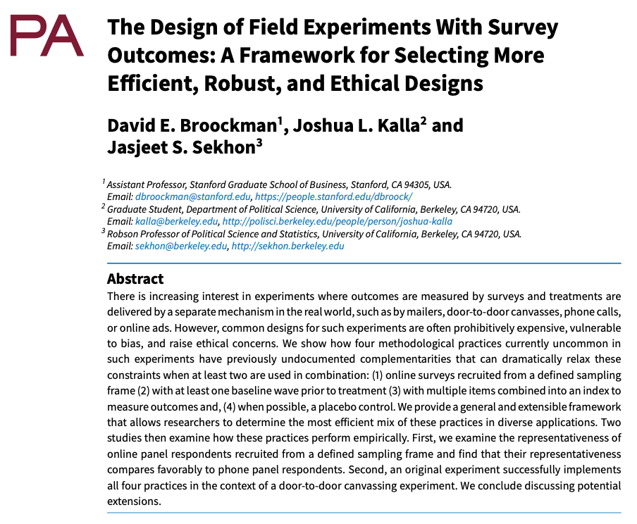
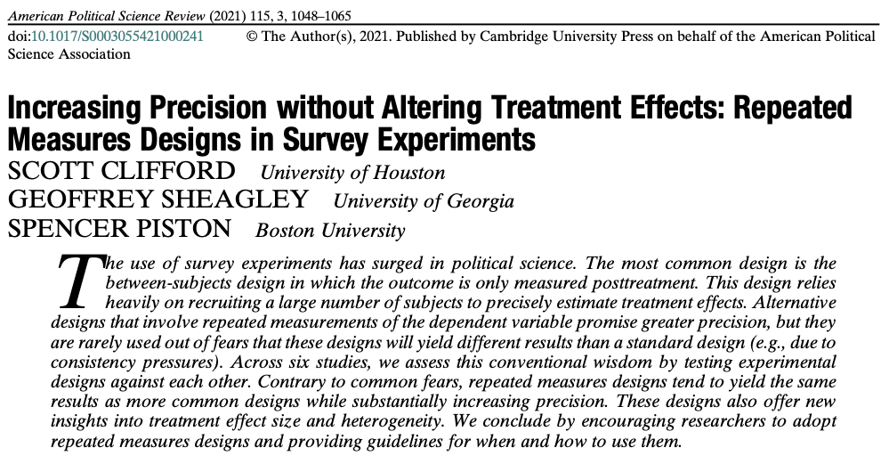

---
format:
  revealjs:
    embed-resources: true
    slide-number: false
    progress: false
    code-overflow: wrap
    code-line-numbers: false
    theme: [default, temp.scss]
---

::: {style="text-align: center"}
##  Balancing Precision and Retention<br>in Experimental Design {.center .smaller}

&nbsp;    

Forthcoming in *Political Analysis*

&nbsp;

:::: columns

::: {.column width="50%"}
**Gustavo Diaz**  
Northwestern University  
<gustavo.diaz@northwestern.edu>  
[gustavodiaz.org](https://gustavodiaz.org)
:::

::: {.column width="50%"}
**Erin Rossiter**  
University of Notre Dame  
<erossite@nd.edu>  
[erossiter.com](https://erossiter.com/)

:::

::::

&nbsp;

Paper and slides: [gustavodiaz.org/tulane](https://gustavodiaz.org/tulane.html)

{.absolute bottom=-100 right=-50 width="200" height="200"}

:::


```{r include=FALSE}
library(knitr)

opts_chunk$set(fig.align = "center",
               echo = FALSE, 
               message = FALSE, 
               warning = FALSE)
```

```{r setup}
# Packages
library(tidyverse)
library(haven)
library(DeclareDesign)
library(tinytable)
library(kableExtra)
library(modelsummary)
library(broom)
library(dagitty) # make DAGs
library(ggdag) # Plot DAGs


# ggplot global options
theme_set(theme_gray(base_size = 25))
ggdodge = position_dodge(width = 0.5)

# color
tulane = "#006747"
```


## A survey experiment

```{r}
declaration = 
  declare_model(
    N = 1000, 
    potential_outcomes(Y ~ rbinom(N, size = 1, prob = -0.08 * Z + 0.5))
  ) +
  declare_inquiry(ATE = mean(Y_Z_1 - Y_Z_0)) +
  declare_assignment(Z = complete_ra(N, prob = 0.5)) +
  declare_measurement(Y = reveal_outcomes(Y ~ Z)) +
  declare_estimator(Y ~ Z, model = difference_in_means, 
                    inquiry = "ATE")

set.seed(5)
experiment = draw_data(declaration) %>% 
  select(ID, Y, Z) 
```


::: incremental
- N = 1,000

- **Vignette:** Incumbent politician seeking reelection

- **Manipulation:** Clean (control); corrupt (treatment)

- **Outcome:** Would you vote to reelect? (0: no, 1: yes)
:::

. . .

::: {.callout-tip}
## Standard design

- Treatments assigned by simple/complete randomization

- Outcome measured once after tretment
:::

## A survey experiment

- N = 1,000

- **Vignette:** Incumbent politician seeking reelection

- **Manipulation:** Clean (control); corrupt (treatment)

- **Outcome:** Would you vote to reelect? (0: no, 1: yes)

```{r}
exp_prop = experiment %>% 
  group_by(Z) %>% 
  summarize(vote = mean(Y)) %>% 
  mutate(Z = ifelse(Z == 0, "Clean", "Corrupt")) %>% 
  rename(Vignette = Z, Vote = vote)

example = lm_robust(Y ~ Z, data = experiment) %>%  
  tidy() %>% 
  filter(term == "Z") %>% 
  mutate(Vignette = "Difference",
         p.value = round(p.value, 5)) %>% 
  select(Vignette, Vote = estimate, p.value)

exp_tab = bind_rows(exp_prop, example)

exp_tab %>% 
  tt() %>% 
  format_tt(
    j = 3,
    replace = TRUE
  )
```


## A survey experiment

```{r}
exp_tab %>% 
  tt() %>% 
  format_tt(
    j = 3,
    replace = TRUE
  )
```

. . .

&nbsp;

::: {.r-stack}
What is the problem?
:::

---

{fig-align="center" width="70%"}


## A survey experiment

```{r}
exp_tab %>% 
  tt() %>% 
  format_tt(
    j = 3,
    replace = TRUE
  )
```

&nbsp;

::: {.r-stack}
What is the problem?
:::

## A survey experiment

```{r}
exp_tab %>% 
  tt() %>% 
  format_tt(
    j = 3,
    replace = TRUE
  )
```

&nbsp;

::: {.r-stack}
What is the problem?  
*Low statistical precision*
:::

. . .

&nbsp;

::: {.r-stack}
What could we have done differently?
:::


## Research design

::: {.r-stack}

{.fragment fig-align="left" width="70%"}

{.fragment fig-align="right" width="80%"}

:::

## Research design


::: {.callout-tip}
## Alternative designs

A deviation from the **standard** design aimed at **improving statistical precision**
:::

. . .

**Puzzle:** Often recommended, rarely implemented

. . .

**Argument:** Scholars wary of hidden costs (*sample loss*)

. . .

**Goal:** Show that benefits outweigh costs

. . .

**Takeaway:** Alternative designs increase precision even when incurring sample loss


# Outline {background-color="#006747"}

1. Theory: Statistical precision, sample loss, alternative designs

2. Replication study: Precision gains withstand sample loss

3. Conclusion: More diversity in research design

4. Related work

# Outline {background-color="#006747"}

1. **Theory: Statistical precision, sample loss, alternative designs**

2. Replication study: Precision gains withstand sample loss

3. Conclusion: More diversity in research design

4. Related work

## Standard experiment

. . .

**Notation**

::: incremental
- $Z_i = \{0,1\}$ condition (0: control, 1: treatment)

- $Y_i(Z_i)$ is the individual **potential outcome**
:::

. . .

Observed outcome

$$
Y_i = \begin{cases}
Y_i(0) & : & Z_i = 0 \\
Y_i(1) & : & Z_i = 1
\end{cases}
$$


## Standard experiment

**Estimator**

. . .

Difference-in-means

$$
\widehat{ATE} = E[Y_i(1) | Z_i = 1] - E[Y_i(0) | Z_i = 0]
$$

. . .


```{r, echo = TRUE, eval = FALSE}
# Difference-in-means
t.test(vote ~ vignette, data = experiment)

# Regression equivalent
lm(vote ~ vignette, data = experiment)
```


## Standard experiment

**Estimator**

Standard error of $\widehat{ATE}$

. . .

$$
SE(\widehat{ATE}) = \sqrt{\frac{\text{Var}(Y_i(0)) + \text{Var}(Y_i(1)) + 2\text{Cov}(Y_i(0), Y_i(1))}{N-1}}
$$
---

&nbsp;

```{r}
set.seed(20250409)
reliable_valid = rnorm(1000, 0, 1)

a = data.frame(
  obs = reliable_valid,
  rel = "Low Variance",
  val = "Low Bias"
)

ggplot(a %>% 
         filter(rel == "Low Variance",
                val == "Low Bias")
       )+
         aes(x = obs) +
         geom_vline(xintercept = 0, 
                    linetype = "dashed") +
         geom_density(linewidth = 2,
                      color = "#006747") +
  labs(x = "Average treatment effect (ATE)",
       y = "Density") + 
  geom_vline(xintercept = 1,
             color = "#006747") +
  geom_vline(xintercept = -1,
             color = "#006747") +
  annotate("text", 
           x = -0.5,
           y = 0.05,
           label = "-1 SE",
           color = tulane,
           size = 7) +
  annotate("text", 
           x = 0.5,
           y = 0.05,
           label = "+1 SE",
           size = 7,
           color = tulane)
```


## Standard experiment

**Estimator**

Standard error of $\widehat{ATE}$


$$
SE(\widehat{ATE}) = \sqrt{\frac{\text{Var}(Y_i(0)) + \text{Var}(Y_i(1)) + 2\text{Cov}(Y_i(0), Y_i(1))}{N-1}}
$$

## Standard experiment

**Estimator**

Standard error of $\widehat{ATE}$ 

$$
SE(\widehat{ATE}) = \sqrt{\frac{\color{#006747}{\text{Var}(Y_i(0)) + \text{Var}(Y_i(1)) + 2\text{Cov}(Y_i(0), Y_i(1))}}{\color{#4E2A84}{N-1}}}
$$

::: {style="color: #006747;"}
**Variance component**

::: incremental
- Make smaller with alternative designs

- Needs access to pre-treatment variables that correlate with (potential) outcomes
:::

:::

## Standard experiment

**Estimator**

Standard error of $\widehat{ATE}$ 

$$
SE(\widehat{ATE}) = \sqrt{\frac{\color{#006747}{\text{Var}(Y_i(0)) + \text{Var}(Y_i(1)) + 2\text{Cov}(Y_i(0), Y_i(1))}}{\color{#4E2A84}{N-1}}}
$$

::: {style="color: #4E2A84;"}
**Sample size component**

::: incremental
- Quadruple $N$ to halve $SE(\widehat{ATE})$

- Cost-prohibitive in many applications

<!-- Especially if you study hard-to-reach populations or non-WEIRD countries -->
:::
:::

## Standard experiment

**Estimator**

Standard error of $\widehat{ATE}$ 

$$
SE(\widehat{ATE}) = \sqrt{\frac{\color{#006747}{\text{Var}(Y_i(0)) + \text{Var}(Y_i(1)) + 2\text{Cov}(Y_i(0), Y_i(1))}}{\color{#4E2A84}{N-1}}}
$$

**Hidden cost**

. . .

Trying to decrease [**variance component**]{style="color: #006747;"} may lead to [**sample loss**]{style="color: #4E2A84;"}

. . .

**Concern:** Offset statistical precision gains

## Sample loss

. . .

::: {.callout-tip}
## Explicit

Sample loss introduced as a *consequence* of implementing an alternative design
:::

. . .

&nbsp;

{fig-align="center"}

## Sample loss

::: {.callout-tip}
## Implicit

Sample loss *internalized by the researcher* before implementing an alternative design
:::


## Sample loss

::: {.callout-tip}
## Implicit

Sample loss *internalized by the researcher* before implementing an alternative design
:::


## Sample loss

::: {.callout-tip}
## Implicit

Sample loss *internalized by the researcher* before implementing an alternative design
:::


:::: {.columns}

::: {.column width="50%"}

:::

::::


## Sample loss

::: {.callout-tip}
## Implicit

Sample loss *internalized by the researcher* before implementing an alternative design
:::


:::: {.columns}

::: {.column width="50%"}

:::

::: {.column width="50%"}

:::

::::


## Sample loss

::: {.callout-tip}
## Implicit

Sample loss *internalized by the researcher* before implementing an alternative design
:::

&nbsp;

::: {.r-stack}

**Fixed budget**

:::

::: {.r-stack}
5 minutes  6 minutes

:::

::: {.r-stack}
N = 1,000  N = 833

:::

::: aside
[prolific.com/calculator](https://www.prolific.com/calculator)
:::


## Example: Pre-post design

. . .

```{r, results = "asis"}
prepost = tribble(
  ~Design, ~`Pre-treatment`, ~Treatment, ~`Post-treatment`,
  "Standard", " ", "$Z_i$", "$Y_i$",
  "Pre-post", "$Y_{i, t=1}$", "$Z_i$", "$Y_{i, t=2}$"
)

prepost %>% 
  kbl(escape = FALSE) %>% 
  row_spec(1:2, color = "#00000000") %>% 
  cat()
```

## Example: Pre-post design

```{r, results='asis'}
prepost %>% 
  kbl(escape = FALSE) %>% 
  row_spec(2, color = "#00000000") %>% 
  cat()
```

## Example: Pre-post design

```{r, results='asis'}
prepost %>% 
  kbl(escape = FALSE) %>%  
  cat()
```

. . .

$$
\widehat{ATE}_{\text{Standard}} = E[Y_i(1) | Z_i = 1] - E[Y_i(0) | Z_i = 0]
$$

. . .

$$
\begin{align}
\widehat{ATE}_{\text{Pre-post}} = & E[(Y_{i,t=2}(1) - Y_{i,t=1}) | Z_i = 1] - \\
& E[(Y_{i,t=2}(0) - Y_{i,t=1}) | Z_i = 0]
\end{align}
$$

## Example: Pre-post design

```{r, results='asis'}
prepost %>% 
  kbl(escape = FALSE) %>%  
  cat()
```


$$
\widehat{ATE}_{\text{Standard}} = E[Y_i(1) | Z_i = 1] - E[Y_i(0) | Z_i = 0]
$$


$$
\begin{align}
\widehat{ATE}_{\text{Pre-post}} = & E[(Y_{i,t=2}(1) \color{#006747}{- Y_{i,t=1}}) | Z_i = 1] - \\
& E[(Y_{i,t=2}(0) \color{#006747}{- Y_{i,t=1}}) | Z_i = 0]
\end{align}
$$

## Example: Pre-post design

```{r, results='asis'}
prepost %>% 
  kbl(escape = FALSE) %>%  
  cat()
```

&nbsp;

```{r, echo = TRUE, eval = FALSE}
# Standard design
lm(vote ~ vignette, data = experiment)

# Pre-post
lm(vote_post ~ vignette + vote_pre, data = experiment)
```


## What does this do?

```{r}
experiment = experiment %>% 
  mutate(vote = Y,
         vote_post = Y,
         vignette = ifelse(Z == 0, "Clean", "Corrupt"))

experiment$vote_pre = correlate(
  given = experiment$vote_post,
  rho = 0.5,
  rbinom, size = 1, prob = 0.5
)
```

. . .

**Standard design**

```{r, echo = TRUE, eval = FALSE}
lm(vote_post ~ vignette, data = experiment)
```


```{r}
lm(vote ~ vignette, data = experiment) %>% 
  tidy() %>% 
  filter(term == "vignetteCorrupt") %>% 
  select(estimate, std.error, p.value) %>% 
  mutate(estimate = round(estimate, 3),
         std.error = round(std.error, 4),
         p.value = round(p.value, 5)) %>% 
  tt()
```

&nbsp;

. . .

**Pre-post design** ($\text{corr} = 0.5$)

```{r, echo = TRUE, eval = FALSE}
lm(vote_post ~ vignette + vote_pre, data = experiment)
```

```{r}
lm(vote_post ~ vignette + vote_pre, data = experiment) %>% 
  tidy() %>% 
  filter(term == "vignetteCorrupt") %>% 
  select(estimate, std.error, p.value) %>% 
  mutate(estimate = round(estimate, 3),
         std.error = round(std.error, 4),
         p.value = round(p.value, 5)) %>%
  tt()
```

## What does this do?

```{r, fig.align='center'}
coords = list(
  x = c(Y_t2 = 1, Z = 0, Y_t1 = -1),
  y = c(Y_t2 = 1, Z = 1, Y_t1 = 1)
)

vote_dag = dagify(
  Y_t2 ~ Z + Y_t1,
  coords = coords,
  labels = c(
    "Y_t2" = "vote_post",
    "Y_t1" = "vote_pre",
    "Z" = "vignette"
  )
) 

vote_dag %>% 
  tidy_dagitty() %>% 
  ggplot(aes(x = x, y = y, xend = xend, yend = yend)) +
  geom_dag_point(size = 20) + 
  geom_dag_edges_arc(
    edge_width = 2,
    curvature = c(-1, 0)) +
  geom_dag_text(
    size = 8,
    parse = TRUE,
    label = c(expression(Y["t=1"]), expression(Y["t=2"]), "Z")
  ) +
  theme_dag()
```


# Outline {background-color="#006747"}

1. **Theory: Statistical precision, sample loss, alternative designs**

2. Replication study: Precision gains withstand sample loss

3. Conclusion: More diversity in research design

4. Related work

# Outline {background-color="#006747"}

1. Theory: Statistical precision, sample loss, alternative designs

2. **Replication study: Precision gains withstand sample loss**

3. Conclusion: More diversity in research design

4. Related work

## Replication study

```{r}
reps = tribble(
  ~` `, ~`[Dietrich and Hayes (2023 JOP)](https://doi.org/10.1086/723966)`, 
  ~`[Bayram and Graham (2022 JOP)](https://doi.org/10.1086/719414)`,
  ~`[Tappin and Hewitt (2023 JEPS)](https://doi.org/10.1017/XPS.2021.22)`,
  "Study", "1 (DH)", "2 (BG)", "3 (TH)",
  "Subfield", "AP", "IR", "AP",
  "Topic", "Race and issue-based symbolism", "Support for IO foreign aid", "Party cues and policy opinions",
  "Arms", "8", "5", "2",
  "Obs.", "515", "1000", "775",
  "Waves", "1", "1", "2",
  "Concern", "Hard to reach population", "More precision", "Effect persistence"
)

reps %>% tt() %>% 
  format_tt(markdown = TRUE) %>% 
  style_tt(fontsize = 0.8)
```

## Replication study

```{r}
reps %>% tt() %>% 
  format_tt(markdown = TRUE) %>% 
  style_tt(fontsize = 0.8) %>% 
  style_tt(
    j = c(2, 4),
    color = "gray"
  ) %>% 
  style_tt(
    j = 3,
    bold = TRUE
  )
```


## Replication design

. . .

:::: {.columns}

::: {.column width="70%"}

```{mermaid}
%%| fig-width: 7
%%| mermaid-format: png
flowchart LR
  A("`**Sample**
  N × 3`")
  A --> B(["Randomize"])
  B --> C("`**Design 1** 
  Post only + 
  Complete randomization
  (Standard)`")
  B --> D("`**Design 2**
  Pre-post +
  Complete randomization`")
  B --> E("`**Design 3**
  Pre-post +
  Block randomization`")
```

:::

::::


## Replication design

:::: {.columns}

::: {.column width="70%"}

```{mermaid}
%%| fig-width: 7
%%| mermaid-format: png
flowchart LR
  A("`**Sample**
  N × 2`")
  A --> B(["Randomize"])
  B --> C("`**Design 1** 
  Post only + 
  Complete randomization
  (Standard)`")
  B --> D("`**Design 2**
  Pre-post +
  Complete randomization`")
```

:::

::: {.column width="30%"}

::: incremental

- N = 2,018

- 50% longer survey

- Focus on *earmarking* cost treatment (vs. control)

:::

:::

::::

. . .

**Principle:** Stack *against* alternative designs

. . .

- **Goal:** Evaluate explicit/implicit sample loss


## Explicit sample loss

```{r}
exp_loss = data.frame(
  Study = c(rep("DH", 3), rep("BG", 3), rep("TH", 3)),
  Design = rep(c("Standard", "Pre-post", "Pre-post + blocking"), 3),
  Kept = c(99.05, 99.03, 99.03, 
           99.05, 99.05, 99.03,
           87, 85.8, 79.3),
  p = c(" ", "p=0.49", "p=1", 
        " ", "p=1", "p=0.12",
        " ", "p=0.37", "p=0.70")
)

exp_loss$Study = fct_relevel(exp_loss$Study,
                             "DH", "BG", "TH")

exp_loss$Design = fct_relevel(exp_loss$Design,
                              "Standard", "Pre-post",
                              "Pre-post + blocking")

bg_only = exp_loss %>% 
  filter(Study == "DH" & Design != "Pre-post + blocking")


ggplot(bg_only) +
  aes(x = Design , y = Kept) +
  geom_col(width = 0.5, position = "dodge", alpha = 0) + 
  labs(y = "% Sample kept") +
  theme(legend.position = "bottom")
```

## Explicit sample loss

```{r}
exp_plot = ggplot(bg_only) +
  aes(x = Design , y = Kept) +
  geom_col(width = 0.5, position = "dodge", fill = tulane) + 
  labs(y = "% Sample kept") +
  theme(legend.position = "bottom")

exp_plot
```


## Also

**No evidence of...**

::: incremental
- Different treatment effects

- Differential sample composition

- Differential post-treatment attrition
:::

## Implicit sample loss

. . .

**Simulation**

::: incremental
- Start with original sample size

- Randomly omit observations *in alternative design only* (0-50%)

- Re-estimate treatment effects and record standard errors

- Calculate % change in standard errors $\frac{(\text{Alternative} - \text{Standard})}{\text{Standard}}$

- Repeat 1,000 times per sample size
:::

## Implicit sample loss

```{r}
sim_summary = readRDS("precision_retention/implicit_loss.rds")

sim_summary = sim_summary %>% 
  mutate(design = ifelse(design == "Pre-post",
                         "Pre-post",
                         "Block randomization"))

sim_summary$design = fct_rev(sim_summary$design)

sim_bg = sim_summary %>% 
  filter(exp == "Bayram & Graham" &
           design != "Block randomization")
```

```{r}
ggplot(sim_bg,
       aes(x = pct_loss,
           y = pct_change)) +
  geom_pointrange(aes(ymin = pct_change_025, ymax = pct_change_975), size = 0.7,
                  position = position_dodge2(width = 0.03), alpha = 0) +
  # Horizontal line at 0
  geom_hline(aes(yintercept = 0),
             linetype = "dashed",
             color = "black") +
  theme(
    panel.border = element_rect(color = "black", fill = NA),
    panel.grid.minor.x = element_blank(),
    text = element_text(size = 14),
    axis.title = element_text(size = 14)
  ) +
  labs(x = "Implicit Sample Loss",
       y = "Percentage Change in Standard Error\nRelative to Standard Design") + 
  scale_y_continuous(limits = c(-50, 90),
                     breaks = seq(-50, 90, by = 25),
                     labels = paste0(seq(-50, 90, by = 25), "%")) +
  scale_x_continuous(breaks = seq(0, .50, by = .10),
                     labels = paste0(seq(0, 50, by = 10), "%"))

```

## Implicit sample loss

```{r}
ggplot(sim_bg,
       aes(x = pct_loss,
           y = pct_change)) +
  geom_pointrange(aes(ymin = pct_change_025, ymax = pct_change_975), size = 0.7,
                  position = position_dodge2(width = 0.03), color = tulane) +
  # Horizontal line at 0
  geom_hline(aes(yintercept = 0),
             linetype = "dashed",
             color = "black") +
  theme(
    panel.border = element_rect(color = "black", fill = NA),
    panel.grid.minor.x = element_blank(),
    text = element_text(size = 14),
    axis.title = element_text(size = 14)
  ) +
  labs(x = "Implicit Sample Loss",
       y = "Percentage Change in Standard Error\nRelative to Standard Design") + 
  scale_y_continuous(limits = c(-50, 90),
                     breaks = seq(-50, 90, by = 25),
                     labels = paste0(seq(-50, 90, by = 25), "%")) +
  scale_x_continuous(breaks = seq(0, .50, by = .10),
                     labels = paste0(seq(0, 50, by = 10), "%"))

```

# Outline {background-color="#006747"}

1. Theory: Statistical precision, sample loss, alternative designs

2. **Replication study: Precision gains withstand sample loss**

3. Conclusion: More diversity in research design

4. Related work

# Outline {background-color="#006747"}

1. Theory: Statistical precision, sample loss, alternative designs

2. Replication study: Precision gains withstand sample loss

3. **Conclusion: More diversity in research design**

4. **Related work**

## Summary

- **Puzzle:** Alternative designs rare

- **Argument:** Concerns about explicit/implicit sample loss offsetting precision gains

- **Findings:** Alternative designs withstand sample loss

- **Contribution:** Tools to navigate research design tradeoffs *before* data collection 

- **Wrinkle:** Alternative designs require extensive piloting

## Also in the paper

::: incremental
1. More replications

2. Simulated replications

3. Balancing precision, retention, *and bias*

4. Guidelines for pre-analysis stage
:::

## Research program

. . .

1. Develop standards to navigate research design tradeoffs *(this project)*

. . .

2. Create *tools* to inform research design choices

---

{fig-align="center" width="60%"}

::: aside
[doi.org/10.1017/XPS.2023.24](https://doi.org/10.1017/XPS.2023.24)
:::

## Research program

1. Develop standards to navigate research design tradeoffs *(this project)*

2. Create *tools* to inform research design choices

. . .

3. Inform applications in CP and political behavior

---

:::: {.columns}

::: {.column width="50%"}


:::

::: {.column width="50%"}


:::

::::

::: aside
[gustavodiaz.org/research](https://gustavodiaz.org/research.html)
:::

# Thank you!

&nbsp;

**Paper and slides:** [gustavodiaz.org/talk](https://gustavodiaz.org/tulane.html)


{fig-align="right" width="200" height="200"}