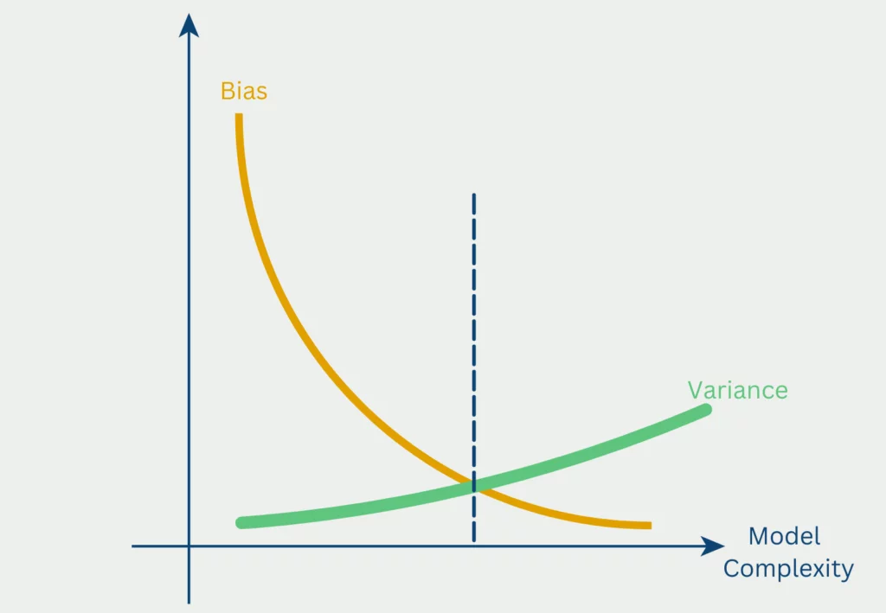

---
format:
  revealjs:
    embed-resources: true
    slide-number: false
    progress: false
    code-overflow: wrap
    theme: [default, temp.scss]
---

::: {style="text-align: center"}
##  Balancing Precision and Retention<br>in Experimental Design {.center .smaller}

&nbsp;    

**Gustavo Diaz**  
Department of Political Science  
Northwestern University  
<gustavo.diaz@northwestern.edu>  
[gustavodiaz.org](https://gustavodiaz.org)

&nbsp;

Paper and slides: [gustavodiaz.org/talk](https://gustavodiaz.org/talk.html)

{.absolute bottom=-100 right=-50 width="200" height="200"}

:::


```{r include=FALSE}
library(knitr)

opts_chunk$set(fig.align = "center",
               echo = FALSE, 
               message = FALSE, 
               warning = FALSE)
```

```{r setup}
# Packages
library(tidyverse)
library(haven)
library(DeclareDesign)
library(tinytable)
library(kableExtra)


# ggplot global options
theme_set(theme_gray(base_size = 25))
ggdodge = position_dodge(width = 0.5)
```

# Pic of PA publication

Acknowledge coauthor

## Measurement as throwing darts

{fig-align="center"}

## Measurement as distributions

```{r}
set.seed(20250409)
reliable_valid = rnorm(1000, 0, 1)
reliable_invalid = rnorm(1000, 5, 1)
unreliable_valid = rnorm(1000, 0, 4)
unreliable_invalid = rnorm(1000, 5, 4)

a = data.frame(
  obs = reliable_valid,
  rel = "Low Variance",
  val = "Low Bias"
)

b = data.frame(
  obs = reliable_invalid,
  rel = "Low Variance",
  val = "High Bias"
)

c = data.frame(
  obs = unreliable_valid,
  rel = "High Variance",
  val = "Low Bias"
)

d = data.frame(
  obs = unreliable_invalid,
  rel = "High Variance",
  val = "High Bias"
)

dat = rbind(a, b, c, d)

dat$val = fct_rev(dat$val)
dat$rel = fct_rev(dat$rel)

rep_dist = ggplot(dat) +
  aes(x = obs) +
  geom_vline(xintercept = 0, linetype = "dashed") +
  geom_density(linewidth = 2, color = "#006747") +
  facet_grid(val ~ rel, switch = "y") +
  labs(
    x = "Average treatment effect (ATE)",
    y = ""
  ) +
  theme(axis.ticks.y = element_blank(),
        axis.text.y = element_blank())

rep_dist
```


## Measurement as distributions

```{r}
rep_dist +
  geom_rect(aes(fill = val), data = dat,
            inherit.aes = FALSE,
            xmin = -Inf, xmax = Inf,
            ymin = -Inf, ymax = Inf,
            alpha = 0.005) +
  scale_fill_manual(values = c(
    "#43B02A", "transparent"
  )) +
  theme(axis.ticks.y = element_blank(),
        axis.text.y = element_blank(),
        legend.position = "none")
```

**Credibility revolution:** Focus on *unbiased* estimators

## Bias-variance tradeoff

{fig-align="center"}

## Summary

- **Puzzle:** Alternative designs rare

- **Argument:** Concerns about explicit/implicit sample loss offsetting precision gains

- **Findings:** Alternative designs withstand sample loss

- **Wrinkle:** Alternative designs require more attention!

- **Takeaway:** Try alternative designs!


::: aside
**Paper and slides:** [gustavodiaz.org/talk](https://gustavodiaz.org/talk.html)
:::

{.absolute bottom=-40 right=-100 width="200" height="200"}
