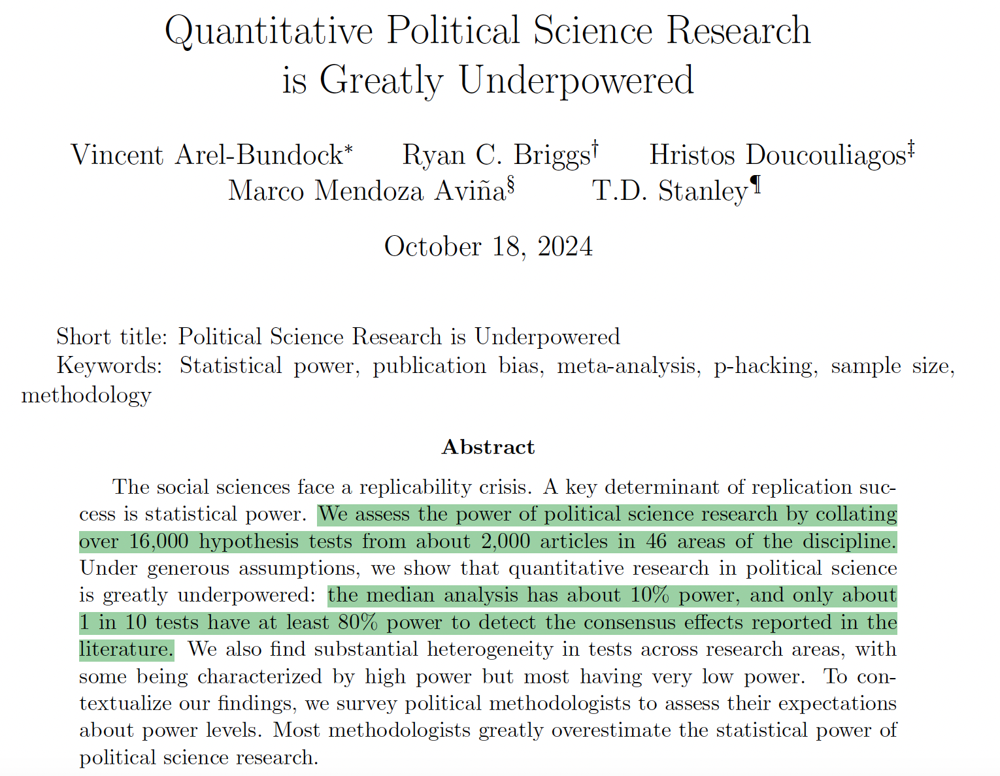
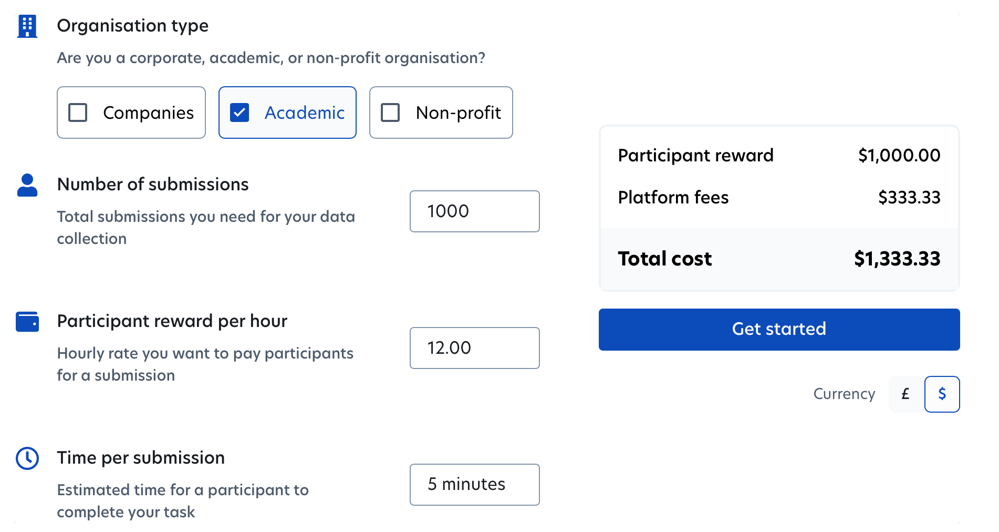
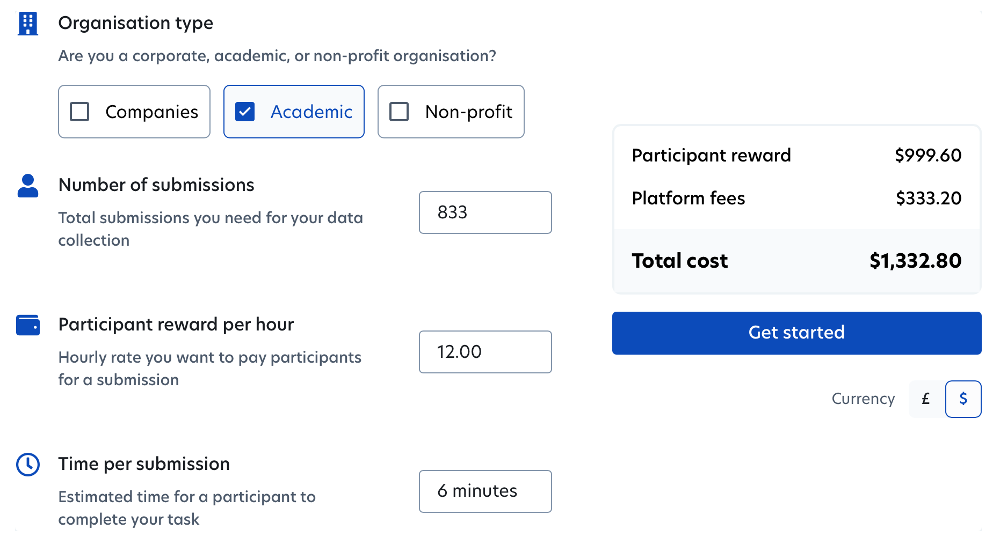
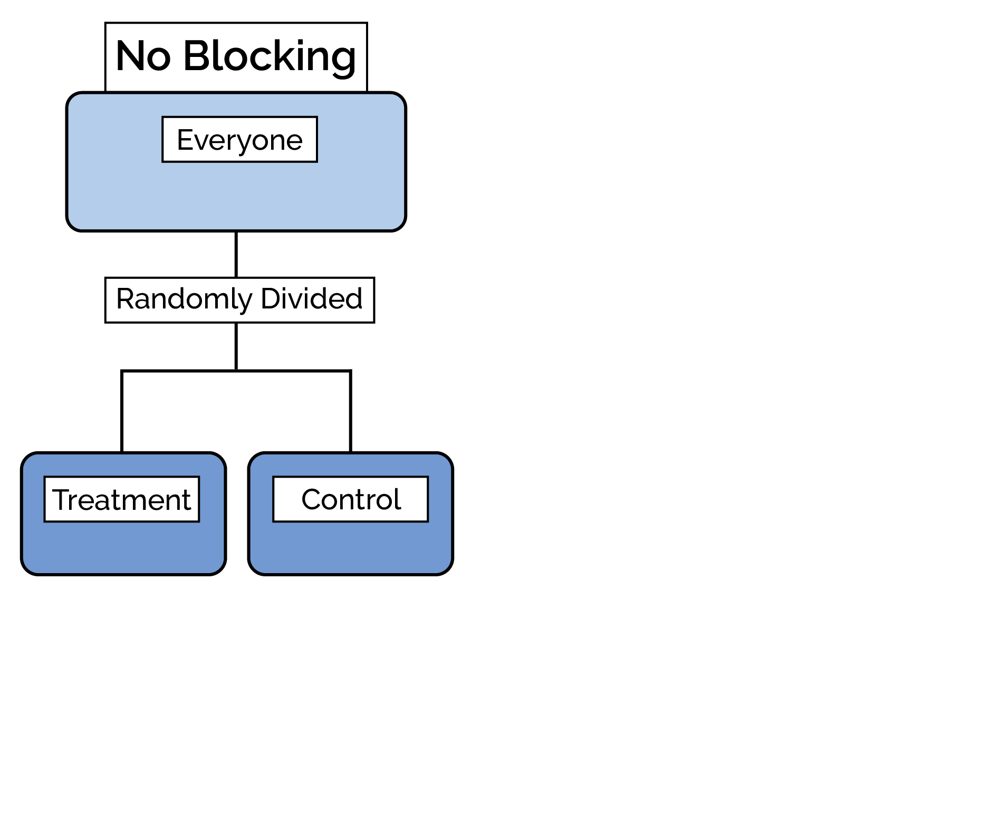
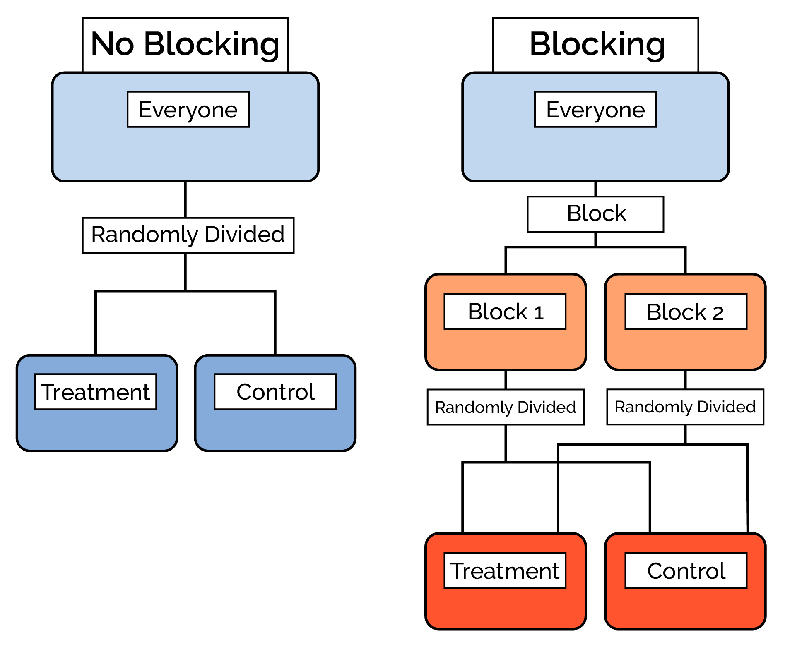
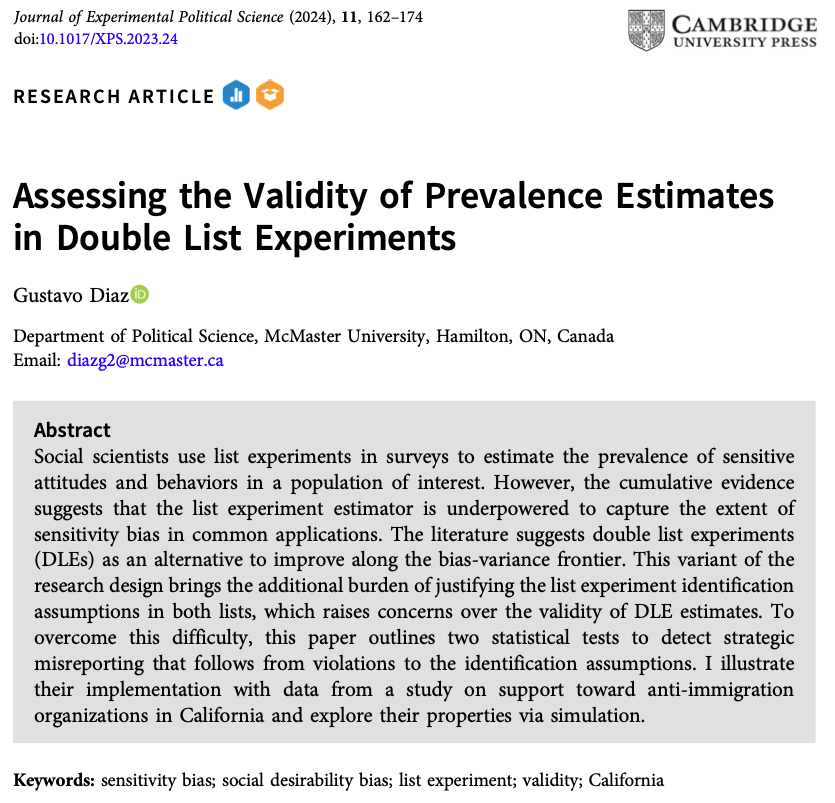
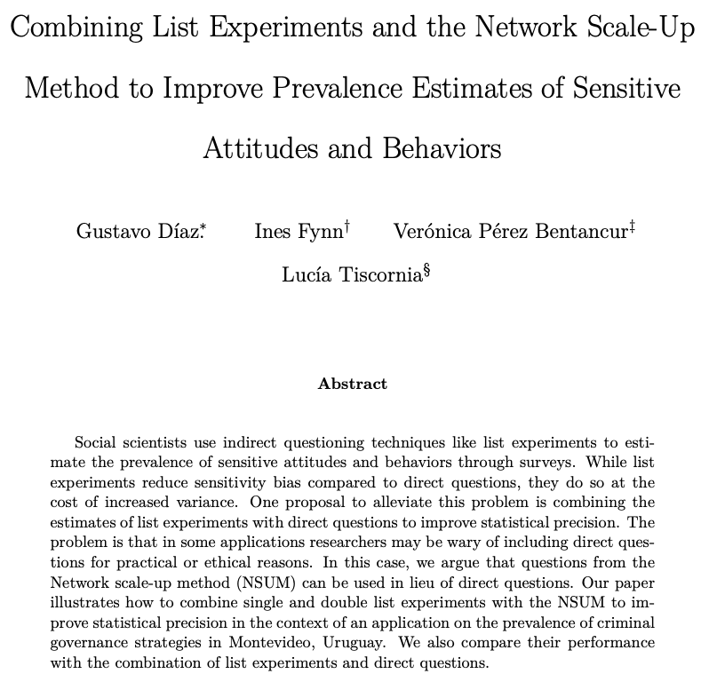

---
format:
  revealjs:
    embed-resources: true
    slide-number: false
    progress: false
    code-overflow: wrap
    code-line-numbers: false
    theme: [default, temp.scss]
---

::: {style="text-align: center"}
##  Balancing Precision and Retention<br>in Experimental Design {.center .smaller}

&nbsp;    

Forthcoming in *Political Analysis*

&nbsp;

:::: columns

::: {.column width="50%"}
**Gustavo Diaz**  
Northwestern University  
<gustavo.diaz@northwestern.edu>  
[gustavodiaz.org](https://gustavodiaz.org)
:::

::: {.column width="50%"}
**Erin Rossiter**  
University of Notre Dame  
<erossite@nd.edu>  
[erossiter.com](https://erossiter.com/)

:::

::::

&nbsp;

Paper and slides: [gustavodiaz.org/talk](https://gustavodiaz.org/talk.html)

{.absolute bottom=-100 right=-50 width="200" height="200"}

:::


```{r include=FALSE}
library(knitr)

opts_chunk$set(fig.align = "center",
               echo = FALSE, 
               message = FALSE, 
               warning = FALSE)
```

```{r setup}
# Packages
library(tidyverse)
library(haven)
library(DeclareDesign)
library(tinytable)
library(kableExtra)


# ggplot global options
theme_set(theme_gray(base_size = 25))
ggdodge = position_dodge(width = 0.5)

# color
tulane = "#006747"
```


## Measurement as throwing darts

{fig-align="center"}

## Measurement as distributions

```{r}
set.seed(20250409)
reliable_valid = rnorm(1000, 0, 1)
reliable_invalid = rnorm(1000, 5, 1)
unreliable_valid = rnorm(1000, 0, 4)
unreliable_invalid = rnorm(1000, 5, 4)

a = data.frame(
  obs = reliable_valid,
  rel = "Low Variance",
  val = "Low Bias"
)

b = data.frame(
  obs = reliable_invalid,
  rel = "Low Variance",
  val = "High Bias"
)

c = data.frame(
  obs = unreliable_valid,
  rel = "High Variance",
  val = "Low Bias"
)

d = data.frame(
  obs = unreliable_invalid,
  rel = "High Variance",
  val = "High Bias"
)

dat = rbind(a, b, c, d)

dat$val = fct_rev(dat$val)
dat$rel = fct_rev(dat$rel)

rep_dist = ggplot(dat) +
  aes(x = obs) +
  geom_vline(xintercept = 0, linetype = "dashed") +
  geom_density(linewidth = 2, color = "#006747") +
  facet_grid(val ~ rel, switch = "y") +
  labs(
    x = "Average treatment effect (ATE)",
    y = ""
  ) +
  theme(axis.ticks.y = element_blank(),
        axis.text.y = element_blank())

rep_dist
```


## Measurement as distributions

```{r}
rep_dist +
  geom_rect(aes(fill = val), data = dat,
            inherit.aes = FALSE,
            xmin = -Inf, xmax = Inf,
            ymin = -Inf, ymax = Inf,
            alpha = 0.005) +
  scale_fill_manual(values = c(
    "#43B02A", "transparent"
  )) +
  theme(axis.ticks.y = element_blank(),
        axis.text.y = element_blank(),
        legend.position = "none")
```

**Credibility revolution:** Focus on *unbiased* estimators

## Bias-variance tradeoff

{fig-align="center"}

---

{fig-align="center" width="70%"}

::: aside
[doi.org/10.1086/734279](https://doi.org/10.1086/734279)
:::

## Solution: Research design

. . .

Many ways to improve statistical precision in experiments before data collection

. . .

:::: {.columns}

::: {.column width="50%"}
- Increasing sample size

- Larger control group

- Aggregate index outcome

- Adjust for covariates

- Pair-matching

- Online balancing
:::

::: {.column width="50%"}

- [MORE THINGS]

- Repeated measures

- Block randomization

:::

::::

## Solution: Research design


Many ways to improve statistical precision in experiments before data collection

**Puzzle:** Political science rarely deviates from standard experimental design

. . .

**Argument:** Scholars wary of hidden costs in alternative designs

. . .

**Goal:** Show that benefits outweigh costs

. . .

**Takeaway:** Statistical precision gains from alternative designs withstand considerable sample loss [wording]

# Outline {background-color="#006747"}

1. Theory: Statistical precision, sample loss, alternative designs

2. Replication studies: Precision gains withstand sample loss

3. Conclusion: More diversity in research design

4. Related work

# Outline {background-color="#006747"}

1. **Theory: Statistical precision, sample loss, alternative designs**

2. Replication studies: Precision gains withstand sample loss

3. Conclusion: More diversity in research design

4. Related work

## Standard experiment

. . .

**Notation**

::: incremental
- $Z_i = \{0,1\}$ condition (0: control, 1: treatment)

- $Y_i(Z_i)$ is the individual **potential outcome**
:::

. . .

Observed outcome

$$
Y_i = \begin{cases}
Y_i(0) & : & Z_i = 0 \\
Y_i(1) & : & Z_i = 1
\end{cases}
$$


## Standard experiment

**Estimator**

. . .

Difference-in-means

$$
\widehat{ATE} = E[Y_i(1) | Z_i = 1] - E[Y_i(0) | Z_i = 0]
$$

. . .


```{r, echo = TRUE, eval = FALSE}
# Difference-in-means
t.test(Y ~ Z, data = data)

# Regression equivalent
lm(Y ~ Z, data = data)
```


## Standard experiment

**Estimator**

Standard error of $\widehat{ATE}$

. . .

$$
SE(\widehat{ATE}) = \sqrt{\frac{\text{Var}(Y_i(0)) + \text{Var}(Y_i(1)) + 2\text{Cov}(Y_i(0), Y_i(1))}{N-1}}
$$
---

&nbsp;

```{r}
ggplot(dat %>% 
         filter(rel == "Low Variance",
                val == "Low Bias")
       )+
         aes(x = obs) +
         geom_vline(xintercept = 0, 
                    linetype = "dashed") +
         geom_density(linewidth = 2,
                      color = "#006747") +
  labs(x = "Average treatment effect (ATE)",
       y = "Density") + 
  geom_vline(xintercept = 1,
             color = "#006747") +
  geom_vline(xintercept = -1,
             color = "#006747") +
  annotate("text", 
           x = -0.5,
           y = 0.05,
           label = "-1 SE",
           color = tulane,
           size = 7) +
  annotate("text", 
           x = 0.5,
           y = 0.05,
           label = "+1 SE",
           size = 7,
           color = tulane)
```


## Standard experiment

**Estimator**

Standard error of $\widehat{ATE}$


$$
SE(\widehat{ATE}) = \sqrt{\frac{\text{Var}(Y_i(0)) + \text{Var}(Y_i(1)) + 2\text{Cov}(Y_i(0), Y_i(1))}{N-1}}
$$

## Standard experiment

**Estimator**

Standard error of $\widehat{ATE}$ 

$$
SE(\widehat{ATE}) = \sqrt{\frac{\color{#006747}{\text{Var}(Y_i(0)) + \text{Var}(Y_i(1)) + 2\text{Cov}(Y_i(0), Y_i(1))}}{\color{#4E2A84}{N-1}}}
$$

::: {style="color: #006747;"}
**Variance component**

::: incremental
- Make smaller with alternative designs

- Needs access to pre-treatment variables that correlate with (potential) outcomes
:::

:::

## Standard experiment

**Estimator**

Standard error of $\widehat{ATE}$ 

$$
SE(\widehat{ATE}) = \sqrt{\frac{\color{#006747}{\text{Var}(Y_i(0)) + \text{Var}(Y_i(1)) + 2\text{Cov}(Y_i(0), Y_i(1))}}{\color{#4E2A84}{N-1}}}
$$

::: {style="color: #4E2A84;"}
**Sample size component**

::: incremental
- Quadruple $N$ to halve $SE(\widehat{ATE})$

- Cost-prohibitive in many applications

<!-- Especially if you study hard-to-reach populations or non-WEIRD countries -->
:::
:::

## Standard experiment

**Estimator**

Standard error of $\widehat{ATE}$ 

$$
SE(\widehat{ATE}) = \sqrt{\frac{\color{#006747}{\text{Var}(Y_i(0)) + \text{Var}(Y_i(1)) + 2\text{Cov}(Y_i(0), Y_i(1))}}{\color{#4E2A84}{N-1}}}
$$

**Hidden cost**

. . .

Trying to decrease [**variance component**]{style="color: #006747;"} may lead to [**sample loss**]{style="color: #4E2A84;"}

. . .

**Concern:** Offset statistical precision gains

## Sample loss

. . .

**Explicit:** Introduced by implementation of alternative designs

. . .

&nbsp;

{fig-align="center"}

## Sample loss

**Implicit:** Costs internalized by researcher


## Sample loss

**Implicit:** Costs internalized by researcher


::: aside
[prolific.com/calculator](https://www.prolific.com/calculator)
:::

## Sample loss

**Implicit:** Costs internalized by researcher


:::: {.columns}

::: {.column width="50%"}

:::

::::

::: aside
[prolific.com/calculator](https://www.prolific.com/calculator)
:::

## Sample loss

**Implicit:** Costs internalized by researcher


:::: {.columns}

::: {.column width="50%"}

:::

::: {.column width="50%"}

:::

::::


::: aside
[prolific.com/calculator](https://www.prolific.com/calculator)
:::

## Sample loss

**Implicit:** Costs internalized by researcher

&nbsp;

::: {.r-stack}

**Fixed budget**

:::

::: {.r-stack}
5 minutes  6 minutes

:::

::: {.r-stack}
N = 1,000  N = 833

:::

::: aside
[prolific.com/calculator](https://www.prolific.com/calculator)
:::

## Alternative designs

. . .

```{r}
lit = tribble(
  ~Randomization, ~`Post-only`, ~`Pre-post`,
  "Simple/Complete", "Standard", "Repeated measures",
  "Blocking", "Block randomized", "Both"
)

lit %>% 
  tt() %>% 
  group_tt(
    j = list(
      "Outcome measurement" = 2:3
    )
  ) %>% 
  style_tt(
    i = 1:2,
    color = "#00000000"
  ) %>% 
  style_tt(
    i = 0,
    j = 2:3,
    color = "#00000000"
  )
```


## Alternative designs

```{r}
lit %>% 
  tt() %>% 
  group_tt(
    j = list(
      "Outcome measurement" = 2:3
    )
  ) %>% 
  style_tt(
    i = 1:2,
    color = "#00000000"
  )
```


## Alternative designs

```{r}
lit %>% 
  tt() %>% 
  group_tt(
    j = list(
      "Outcome measurement" = 2:3
    )
  ) %>% 
  style_tt(
    i = 1:2,
    j = 2:3,
    color = "#00000000"
  ) %>% 
  style_tt(
    i = 2,
    j = 1,
    color = "#00000000"
  )
```

## Alternative designs

```{r}
lit %>% 
  tt() %>% 
  group_tt(
    j = list(
      "Outcome measurement" = 2:3
    )
  ) %>% 
  style_tt(
    i = 2,
    j = 2:3,
    color = "#00000000"
  ) %>% 
    style_tt(
    i = 1,
    j = 3,
    color = "#00000000"
  ) %>% 
  style_tt(
    i = 2,
    j = 1,
    color = "#00000000"
  )
```

## Alternative designs

```{r}
lit %>% 
  tt() %>% 
  group_tt(
    j = list(
      "Outcome measurement" = 2:3
    )
  ) %>% 
  style_tt(
    i = 2,
    j = 2:3,
    color = "#00000000"
  ) %>% 
  style_tt(
    i = 2,
    j = 1,
    color = "#00000000"
  )
```

## Repeated measures

. . .

```{r, results = "asis"}
prepost = tribble(
  ~Design, ~`Pre-treatment`, ~Treatment, ~`Post-treatment`,
  "Standard", " ", "$Z_i$", "$Y_i$",
  "Pre-post", "$Y_{i, t=1}$", "$Z_i$", "$Y_{i, t=2}$"
)

prepost %>% 
  kbl(escape = FALSE) %>% 
  row_spec(1:2, color = "#00000000") %>% 
  cat()
```

## Repeated measures

```{r, results='asis'}
prepost %>% 
  kbl(escape = FALSE) %>% 
  row_spec(2, color = "#00000000") %>% 
  cat()
```

## Repeated measures

```{r, results='asis'}
prepost %>% 
  kbl(escape = FALSE) %>%  
  cat()
```

. . .

$$
\widehat{ATE}_{\text{Standard}} = E[Y_i(1) | Z_i = 1] - E[Y_i(0) | Z_i = 0]
$$

. . .

$$
\begin{align}
\widehat{ATE}_{\text{Pre-post}} = & E[(Y_{i,t=2}(1) - Y_{i,t=1}) | Z_i = 1] - \\
& E[(Y_{i,t=2}(0) - Y_{i,t=1}) | Z_i = 0]
\end{align}
$$

## Repeated measures

```{r, results='asis'}
prepost %>% 
  kbl(escape = FALSE) %>%  
  cat()
```


$$
\widehat{ATE}_{\text{Standard}} = E[Y_i(1) | Z_i = 1] - E[Y_i(0) | Z_i = 0]
$$


$$
\begin{align}
\widehat{ATE}_{\text{Pre-post}} = & E[(Y_{i,t=2}(1) \color{#006747}{- Y_{i,t=1}}) | Z_i = 1] - \\
& E[(Y_{i,t=2}(0) \color{#006747}{- Y_{i,t=1}}) | Z_i = 0]
\end{align}
$$

## Repeated measures

```{r, results='asis'}
prepost %>% 
  kbl(escape = FALSE) %>%  
  cat()
```

&nbsp;

```{r, echo = TRUE, eval = FALSE}
# Standard design
lm(Y ~ Z, data = data)

# Pre-post
lm(Y_t2 ~ Z + Y_t1, data = data)
```

## Alternative designs

```{r}
lit %>% 
  tt() %>% 
  group_tt(
    j = list(
      "Outcome measurement" = 2:3
    )
  ) %>% 
  style_tt(
    i = 2,
    j = 2:3,
    color = "#00000000"
  ) %>% 
  style_tt(
    i = 2,
    j = 1,
    color = "#00000000"
  )
```

## Alternative designs

```{r}
lit %>% 
  tt() %>% 
  group_tt(
    j = list(
      "Outcome measurement" = 2:3
    )
  ) %>% 
  style_tt(
    i = 2,
    j = 2:3,
    color = "#00000000"
  )
```


## Alternative designs

```{r}
lit %>% 
  tt() %>% 
  group_tt(
    j = list(
      "Outcome measurement" = 2:3
    )
  )
```

## Block randomization

<!-- https://discovery.cs.illinois.edu/learn/Basics-of-Data-Science-with-Python/Experimental-Design-and-Blocking/-->
. . .

:::: {.columns}

::: {.column width="70%"}
{fig-align="center"}

:::

::::

## Block randomization

:::: {.columns}

::: {.column width="70%"}
{fig-align="center"}

:::

::::

## Block randomization

:::: {.columns}

::: {.column width="70%"}
{fig-align="center"}

:::

::: {.column width="30%"}
Weighted average across blocks:

$$\widehat{ATE}_{\text{Block}} = \sum_{b=1}^B \frac{n_b}{N} \widehat{ATE}_b$$
:::
::::

## Block randomization

:::: {.columns}

::: {.column width="70%"}
{fig-align="center"}

:::

::: {.column width="30%"}
Weighted average across blocks:

$$\widehat{ATE}_{\text{Block}} = \sum_{b=1}^B \frac{n_b}{N} \widehat{ATE}_b$$


```{r, echo = TRUE, eval = FALSE}
# Standard design
lm(Y ~ Z, 
   data = data)

# Block randomized
lm(Y ~ Z + block, 
   data = data)
```

:::
::::

## Alternative designs

```{r}
lit %>% 
  tt() %>% 
  group_tt(
    j = list(
      "Outcome measurement" = 2:3
    )
  )
```

. . .

Why these?

## Often recommended but rarely implemented

## Often recommended but rarely implemented

```{r}
journals = tribble(
  ~` `, ~N, ~`%`,
  "Pre-post", 10, "5%",
  "Blocking", 16, "7%",
  "Both", 6, "3%",
  "Neither", 184, "85%"
)

journals %>% tt() %>% style_tt(fontsize = 0.9)
```


::: aside
Based on 2022-23 articles published in APSR, AJPS, JOP, PB, CPS, JEPS
:::

## Often recommended but rarely implemented

```{r}
journals2 = tribble(
  ~` `, ~N, ~`%`,
  "Pre-post", 10, "5%",
  "Blocking", 16, "7%",
  "Both", 6, "3%",
  "Mention covariates", 169, "78%",
  "Nothing", 15, "7%" 
)

journals2 %>% 
  tt() %>% 
  group_tt(i = list(
    "Neither" = 4
  )) %>% 
  style_tt(
    i = 5:6,
    color = "#00000000"
  ) %>% 
  style_tt(fontsize = 0.9)

```

::: aside
Based on 2022-23 articles published in APSR, AJPS, JOP, PB, CPS, JEPS
:::

## Often recommended but rarely implemented

```{r}
journals2 = tribble(
  ~` `, ~N, ~`%`,
  "Pre-post", 10, "5%",
  "Blocking", 16, "7%",
  "Both", 6, "3%",
  "Mention covariates", 169, "78%",
  "Nothing", 15, "7%" 
)

journals2 %>% 
  tt() %>% 
  group_tt(i = list(
    "Neither" = 4
  )) %>% 
  style_tt(fontsize = 0.9)

```

::: aside
Based on 2022-23 articles published in APSR, AJPS, JOP, PB, CPS, JEPS
:::

# Outline {background-color="#006747"}

1. **Theory: Statistical precision, sample loss, alternative designs**

2. Replication studies: Precision gains withstand sample loss

3. Conclusion: More diversity in research design

4. Related work

# Outline {background-color="#006747"}

1. Theory: Statistical precision, sample loss, alternative designs

2. **Replication studies: Precision gains withstand sample loss**

3. Conclusion: More diversity in research design

4. Related work

## Replication studies

```{r}
reps = tribble(
  ~` `, ~`[Dietrich and Hayes (2023 JOP)](https://doi.org/10.1086/723966)`, 
  ~`[Bayram and Graham (2022 JOP)](https://doi.org/10.1086/719414)`,
  ~`[Tappin and Hewitt (2023 JEPS)](https://doi.org/10.1017/XPS.2021.22)`,
  "Study", "1 (DH)", "2 (BG)", "3 (TH)",
  "Subfield", "AP", "IR", "AP",
  "Topic", "Race and issue-based symbolism", "Support for IO foreign aid", "Party cues and policy opinions",
  "Arms", "8", "5", "2",
  "Obs.", "515", "1000", "775",
  "Waves", "1", "1", "2",
  "Concern", "Hard to reach population", "More precision", "Effect persistence"
)

reps %>% tt() %>% 
  format_tt(markdown = TRUE) %>% 
  style_tt(fontsize = 0.8) %>% 
  style_tt(j = 2:4,
           color = "#00000000")
```

## Replication studies

```{r}
reps %>% tt() %>% 
  format_tt(markdown = TRUE) %>% 
  style_tt(fontsize = 0.8) %>% 
  style_tt(j = 3:4,
           color = "#00000000")
```


## Replication studies

```{r}
reps %>% tt() %>% 
  format_tt(markdown = TRUE) %>% 
  style_tt(fontsize = 0.8) %>% 
  style_tt(j = 4,
           color = "#00000000")
```

## Replication studies

```{r}
reps %>% tt() %>% 
  format_tt(markdown = TRUE) %>% 
  style_tt(fontsize = 0.8)
```


## Replication design

. . .

:::: {.columns}

::: {.column width = "70%"}

```{mermaid}
%%| fig-width: 7
%%| mermaid-format: png
flowchart LR
  A("`**Sample**
  N × 3`")
  A --> B(["Randomize"])
  B --> C("`**Design 1** 
  Post only + 
  Complete randomization
  (Standard)`")
  B --> D("`**Design 2**
  Pre-post +
  Complete randomization`")
  B --> E("`**Design 3**
  Pre-post +
  Block randomization`")
```

:::

::: {.column width="30%"}

::: incremental

- **Total N:** 6,605

- **Longer surveys:** 43%, 50%, 110%

- **Principle:** Stack *against* alternative designs

- **Goal:** Evaluate explicit/implicit sample loss

:::

:::

::::

## Explicit sample loss

```{r}
exp_loss = data.frame(
  Study = c(rep("DH", 3), rep("BG", 3), rep("TH", 3)),
  Design = rep(c("Standard", "Pre-post", "Pre-post + blocking"), 3),
  Kept = c(99.05, 99.03, 99.03, 
           99.05, 99.05, 99.03,
           87, 85.8, 79.3),
  p = c(" ", "p=0.49", "p=1", 
        " ", "p=1", "p=0.12",
        " ", "p=0.37", "p=0.70")
)

exp_loss$Study = fct_relevel(exp_loss$Study,
                             "DH", "BG", "TH")

exp_loss$Design = fct_relevel(exp_loss$Design,
                              "Standard", "Pre-post",
                              "Pre-post + blocking")

ggplot(exp_loss) +
  aes(x = Study, y = Kept, fill = Design) +
  geom_col(width = 0.5, position = "dodge", alpha = 0) + 
  scale_fill_viridis_d() +
  labs(y = "% Sample kept") +
  theme(legend.position = "bottom") +
  geom_text(
    data = exp_loss,
    mapping = aes(x = Study, y = Kept + 4,
                  label = p),             
    position = position_dodge(
                    width = 0.5
                  ),
    size = 4, alpha = 0
  )
```

## Explicit sample loss

```{r}
exp_plot = ggplot(exp_loss) +
  aes(x = Study, y = Kept, fill = Design) +
  geom_col(width = 0.5, position = "dodge") + 
  scale_fill_viridis_d() +
  labs(y = "% Sample kept") +
  theme(legend.position = "bottom")

exp_plot +
  geom_text(
    data = exp_loss,
    mapping = aes(x = Study, y = Kept + 4,
                  label = p),             
    position = position_dodge(
                    width = 0.5
                  ),
    size = 4, alpha = 0
  )
```

## Explicit sample loss

```{r}
exp_plot +
  geom_text(
    data = exp_loss,
    mapping = aes(x = Study, y = Kept + 4,
                  label = p),             
    position = position_dodge(
                    width = 0.5
                  ),
    size = 4
  )
```


## Also

**No evidence of...**

::: incremental
- Different treatment effects

- Differential sample composition

- Differential post-treatment attrition
:::

## Implicit sample loss

## Implicit sample loss

```{r}
sim_summary = readRDS("precision_retention/implicit_loss.rds")

sim_summary = sim_summary %>% 
  mutate(design = ifelse(design == "Pre-post",
                         "Pre-post",
                         "Block randomization"))

sim_summary$design = fct_rev(sim_summary$design)

ggplot(sim_summary, aes(x = pct_loss,
                                                   y = pct_change,
                                                   color = factor(design),
                                                   shape = factor(design))) +
  facet_wrap(~exp, scales = "fixed", nrow = 1) +
  geom_pointrange(aes(ymin = pct_change_025, ymax = pct_change_975), size = 0.7,
                  position = position_dodge2(width = 0.03), alpha = 0) +
  # Horizontal line at 0
  geom_hline(aes(yintercept = 0),
             linetype = "dashed",
             color = "black") +
  theme_gray() +
  theme(
    panel.border = element_rect(color = "black", fill = NA),
    panel.grid.minor.x = element_blank(),
    text = element_text(size = 14),
    axis.title = element_text(size = 14),
    legend.title = element_text(size = 14),
    legend.text = element_text(size = 14),
    strip.text = element_text(size = 14),
    legend.position = "bottom"
  ) +
  labs(x = "Implicit Sample Loss",
       y = "Percentage Change in Standard Error\nRelative to Standard Design",
       color = "Design") + 
  scale_color_manual(values = c("grey50", "grey20")) +
  scale_shape_manual(values = c(16,17)) + 
  guides(color = guide_legend(title = "Design", override.aes = list(shape = c(16,17)),
                              ncol = 2),
         shape = FALSE) +
  scale_y_continuous(limits = c(-50, 90),
                     breaks = seq(-50, 90, by = 25),
                     labels = paste0(seq(-50, 90, by = 25), "%")) +
  scale_x_continuous(breaks = seq(0, .50, by = .10),
                     labels = paste0(seq(0, 50, by = 10), "%"))

```

## Implicit sample loss

```{r}
p0 = ggplot(sim_summary, aes(x = pct_loss,
                                               y = pct_change,
                                               color = factor(design),
                                               shape = factor(design))) +
  facet_wrap(~exp, scales = "fixed", nrow = 1) +
  geom_pointrange(aes(ymin = pct_change_025, ymax = pct_change_975), 
                  size = 0.7,
                  linewidth = 1,
                  position = position_dodge2(width = 0.03)) +
  # Horizontal line at 0
  geom_hline(aes(yintercept = 0),
             linetype = "dashed",
             color = "black") +
  theme_gray() +
  theme(
    panel.border = element_rect(color = "black", fill = NA),
    panel.grid.minor.x = element_blank(),
    text = element_text(size = 14),
    axis.title = element_text(size = 14),
    legend.title = element_text(size = 14),
    legend.text = element_text(size = 14),
    strip.text = element_text(size = 14),
    legend.position = "bottom"
  ) +
  labs(x = "Implicit Sample Loss",
       y = "Percentage Change in Standard Error\nRelative to Standard Design",
       color = "Design") + 
  scale_color_viridis_d(begin = 0, end = 0.5) +
  scale_shape_manual(values = c(16,17)) + 
  guides(color = guide_legend(title = "Design", override.aes = list(shape = c(16,17)),
                              ncol = 2),
         shape = FALSE) +
  scale_y_continuous(limits = c(-50, 90),
                         breaks = seq(-50, 90, by = 25),
                         labels = paste0(seq(-50, 90, by = 25), "%")) +
  scale_x_continuous(breaks = seq(0, .50, by = .10),
                     labels = paste0(seq(0, 50, by = 10), "%"))

p0

```

## Implicit sample loss

```{r}
# annotations

text = data.frame(
  label = c("Sample too small +\n bad proxy outcome", 
            "Ideal case", 
            "Continuous blocking"),
  pct_loss = c(0.2, 0.2, 0.2),
  pct_change = c(-25, 25, 40),
  exp = c("Dietrich & Hayes",
          "Bayram & Graham",
          "Tappin & Hewitt"),
  design = c("Pre-post", "Pre-post", "Block randomization" )
)

text$exp = fct_relevel(text$exp,
                      "Dietrich & Hayes",
          "Bayram & Graham",
          "Tappin & Hewitt" )
p0 +
  geom_text(
    data = text,
    mapping = aes(x = pct_loss, y = pct_change,
                  label = label),
    size = 5
  )
```

# Outline {background-color="#006747"}

1. Theory: Statistical precision, sample loss, alternative designs

2. **Replication studies: Precision gains withstand sample loss**

3. Conclusion: More diversity in research design

4. Related work

# Outline {background-color="#006747"}

1. Theory: Statistical precision, sample loss, alternative designs

2. Replication studies: Precision gains withstand sample loss

3. **Conclusion: More diversity in research design**

4. **Related work**

## Summary

- **Puzzle:** Alternative designs rare

- **Argument:** Concerns about explicit/implicit sample loss offsetting precision gains

- **Findings:** Alternative designs withstand sample loss

- **Wrinkle:** Alternative designs require more attention!

- **Takeaway:** Try alternative designs!

## Also in the paper

::: incremental
1. More (simulated) replications

2. Balancing precision, retention, *and bias*

3. Guidelines for pre-analysis stage
:::

## Research program

. . .

1. Develop standards to navigate research design tradeoffs *(this project)*

. . .

2. Create *tools* to inform research design choices

---

{fig-align="center" width="60%"}

::: aside
[doi.org/10.1017/XPS.2023.24](https://doi.org/10.1017/XPS.2023.24)
:::

## Research program

1. Develop standards to navigate research design tradeoffs *(this project)*

2. Create *tools* to inform research design choices

. . .

3. Inform applications in CP and political behavior

---

:::: {.columns}

::: {.column width="50%"}


:::

::: {.column width="50%"}



:::

::::

::: aside
[gustavodiaz.org/research](https://gustavodiaz.org/research.html)
:::

# Thank you!

&nbsp;

**Paper and slides:** [gustavodiaz.org/talk](https://gustavodiaz.org/talk.html)


{fig-align="right" width="200" height="200"}