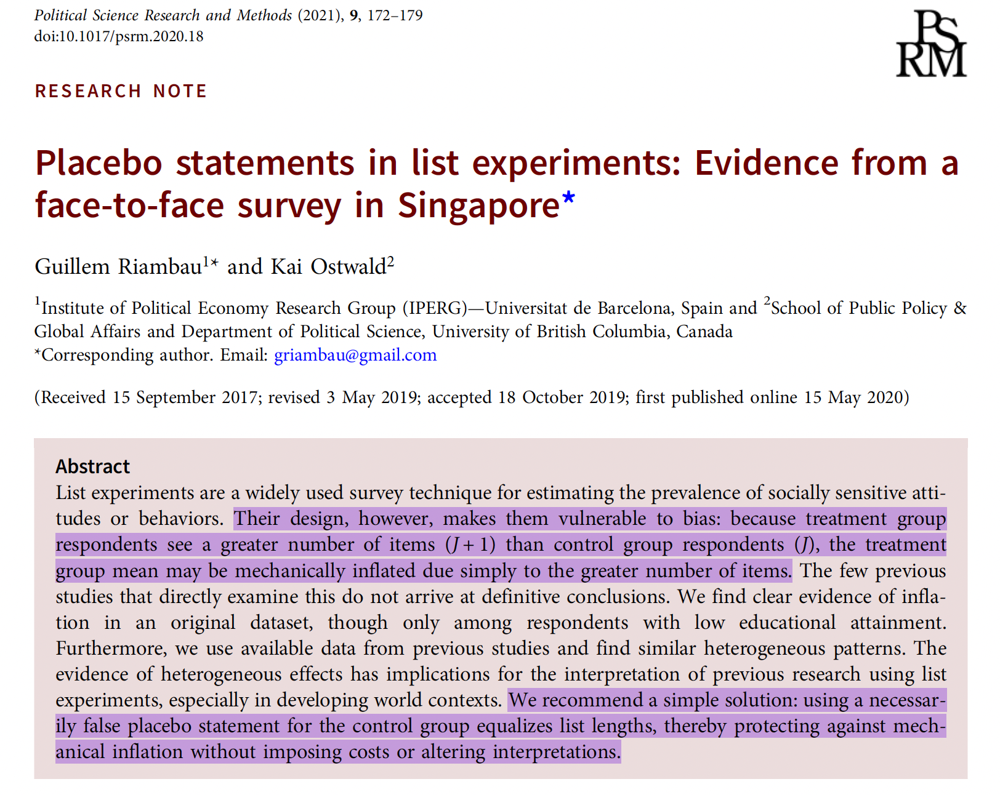

---
format:
  revealjs:
    center: true
    slide-number: false
    progress: false
    code-line-numbers: false
    theme: [default, custom.scss]
---

::: {style="text-align: center"}
##  Recovering Informative Estimates<br>in Failed Placebo-Controlled<br>List Experiments {.center .smaller}

&nbsp;

**Gustavo Diaz**  
Northwestern University  
<gustavo.diaz@northwestern.edu>  

&nbsp;


Paper and slides: [gustavodiaz.org/talk](https://gustavodiaz.org/talk)

{.absolute bottom=-100 right=-50 width="180" height="180"}

:::

```{r include=FALSE}
library(knitr)

opts_chunk$set(fig.pos = "center", echo = FALSE, 
               message = FALSE, warning = FALSE)
```

```{r setup}
# Packages
library(tidyverse)
library(DeclareDesign)
library(kableExtra)
library(tinytable)


# ggplot global options
theme_set(theme_gray(base_size = 20))

# Northwestern purple
nu_purple = "#4E2A84"
```

## ERC Starting Grant
**Criminal Governance in Unexpected Contexts: the Role of the Welfare State in Latin America**

with 

- [Verónica Pérez Bentancur](https://veronicaperezbentancur.com/homepage-ingles/) (Universidad de la República)
- [Ines Fynn](https://www.inesfynn.com) (Universidad Católica del Uruguay )
- [Lucía Tiscornia](https://luciatiscornia.com) (University College Dublin)

## Takeaways

- We included a placebo statement in our list experiment and it broke everything

- Use ideas from partial identification to recover *informative* estimates

- Looking for more ideas to refine bounds

## Agenda

- Improving list experiments

- Our failed placebo (double) list experiment

- Recovering informative estimates

- Discussion

# List Experiments

---

  Now I am going to read you things that make people angry or upset


---

 After I read them all, tell me HOW MANY of them upset you


---

 I don't want to know which ones, just tell me HOW MANY

. . .

### Control group

1. The federal government increasing tax on gasoline
2. Professional athletes getting million dollar contracts
3. Large corporations polluting the environment

::: aside
**Adapted from:** Kuklinski, Cobb, and Gilens. 1997. ["Racial Attitudes and the 'New South'."](https://doi.org/10.1017/S0022381600053470) *Journal of Politics* 59 (2): 323-349
:::

---

 I don't want to know which ones, just tell me HOW MANY

### Treatment group

1. The federal government increasing tax on gasoline
2. Professional athletes getting million dollar contracts
3. Large corporations polluting the environment

::: aside
**Adapted from:** Kuklinski, Cobb, and Gilens. 1997. ["Racial Attitudes and the 'New South'."](https://doi.org/10.1017/S0022381600053470) *Journal of Politics* 59 (2): 323-349
:::

---

 I don't want to know which ones, just tell me HOW MANY

### Treatment group

1. The federal government increasing tax on gasoline
2. Professional athletes getting million dollar contracts
3. Large corporations polluting the environment
4. **A black family moving next door**

::: aside
**Adapted from:** Kuklinski, Cobb, and Gilens. 1997. ["Racial Attitudes and the 'New South'."](https://doi.org/10.1017/S0022381600053470) *Journal of Politics* 59 (2): 323-349
:::


## Reduces sensitivity bias

```{r}
# got this through
# https://automeris.io/WebPlotDigitizer/
# And by reverse engineering fig 1
# Because replication data was not available
# So this has some human error
validation = data.frame(
  technique = c("Direct question", "List experiment"),
  estimate = c(0.396, 0.487),
  upper = c(0.419, 0.562),
  lower = c(0.376, 0.417)
)

actual_vote = 0.65

ggplot(validation) +
  aes(x = technique, y = estimate) +
  geom_point(size = 4, alpha = 0) + 
  geom_linerange(aes(x = technique, ymin = lower, ymax = upper),
                 linewidth = 1, alpha = 0) +
  ylim(0.2, 0.8) +
  labs(x = "Technique", 
       y = "Proportion sensitive item")
```

::: aside
**Adapted from:** Rosenfeld, Imai, and Shapiro. 2016. ["An Empirical Validation Study of Popular Survey Methodologies for Sensitive Questions."](https://doi.org/10.1111/ajps.12205) *American Journal of Political Science* 60 (3): 783-802
:::

## Reduces sensitivity bias

```{r}
ggplot(validation) +
  aes(x = technique, y = estimate) +
  geom_hline(yintercept = actual_vote, 
             linetype = "dashed",
             linewidth = 1) +
  geom_point(size = 4, alpha = 0) + 
  geom_linerange(aes(x = technique, ymin = lower, ymax = upper),
                 linewidth = 1, alpha = 0) +
  annotate("text", x = 0.7, y = 0.7, size = 5, 
           label = "True proportion") +
  ylim(0.2, 0.8) +
  labs(x = "Technique", 
       y = "Proportion sensitive item")
```

::: aside
**Adapted from:** Rosenfeld, Imai, and Shapiro. 2016. ["An Empirical Validation Study of Popular Survey Methodologies for Sensitive Questions."](https://doi.org/10.1111/ajps.12205) *American Journal of Political Science* 60 (3): 783-802
:::


## Reduces sensitivity bias

```{r}
ggplot(validation) +
  aes(x = technique, y = estimate) +
  geom_hline(yintercept = actual_vote, 
             linetype = "dashed",
             linewidth = 1) +
  geom_point(size = 4) + 
  geom_linerange(aes(x = technique, ymin = lower, ymax = upper),
                 linewidth = 1) +
  annotate("text", x = 0.7, y = 0.7, size = 5, 
           label = "True proportion") +
  ylim(0.2, 0.8) +
  labs(x = "Technique", 
       y = "Proportion sensitive item")
```

::: aside
**Adapted from:** Rosenfeld, Imai, and Shapiro. 2016. ["An Empirical Validation Study of Popular Survey Methodologies for Sensitive Questions."](https://doi.org/10.1111/ajps.12205) *American Journal of Political Science* 60 (3): 783-802
:::

## Concerns with list experiments

1. Strategic errors

2. Non-strategic errors

## Concerns with list experiments

1. Strategic errors

2. **Non-strategic errors**

---

{fig-align="center"}

## Artificial inflation

```{r}
inflation = tribble(
  ~Control, ~Treatment,
  "The federal government increasing tax on gasoline",
  "The federal government increasing tax on gasoline",
  "Professional athletes getting million dollar contracts",
  "Professional athletes getting million dollar contracts",
  "Large corporations polluting the environment",
  "Large corporations polluting the environment",
  " ",
  "**A black family moving next door**"
)

inflation %>% 
  tt() %>%
  format_tt(markdown = TRUE)
```


::: aside
Things that make people angry or upset
:::

## Solution: Add a placebo statement

```{r}
inflation %>% tt() %>% format_tt(markdown = TRUE)
```

::: aside
Things that make people angry or upset
:::

## Solution: Add a placebo statement

```{r}
inflation2 = tribble(
  ~Control, ~Treatment,
  "The federal government increasing tax on gasoline",
  "The federal government increasing tax on gasoline",
  "Professional athletes getting million dollar contracts",
  "Professional athletes getting million dollar contracts",
  "Large corporations polluting the environment",
  "Large corporations polluting the environment",
  "**Finding money in a jacket pocket**",
  "**A black family moving next door**"
)

inflation2 %>% tt() %>% 
  format_tt(markdown = TRUE) %>% 
  style_tt(i = 4, j = 1, color = nu_purple)
```

::: aside
Things that make people angry or upset
:::

## Placebo-controlled list experiments {.center}

. . .

Reduce bias from *non-strategic* response errors

. . . 

But a  **bad placebo item** can introduce *attenuation bias*

::: {style="text-align: center"}
## It happened to us! {.center}
:::

# Our Experiment

## Double list experiment

Things people have experienced in the last six months:

```{r}
list0 = tribble(
  ~`List A`, ~`List B`,
  "Saw people doing sports", "Saw people playing soccer",
  "Visited friends", "Chatted with friends",
  "Activities by feminist groups", "Activities by LGBTQ groups",
  "Went to church", "Went to charity events"
)

list0 %>% tt()
```

::: aside
Online sample in Montevideo, Uruguay. $N = 2688$.<br>Block-randomized by police-defined risk zones.
:::

## Manipulations

. . .

**Sensitive items:** 

- Saw criminal groups threatening neighbors
- Saw criminal groups evicting neighbors from their homes
- Saw criminal groups making donations to neighbors
- Saw criminal groups offering work to neighbors

## Manipulations

**Sensitive items:** 

- **Saw criminal groups threatening neighbors**
- [Saw criminal groups evicting neighbors from their homes]{style="color: gray;"}
- [Saw criminal groups making donations to neighbors]{style="color: gray;"}
- [Saw criminal groups offering work to neighbors]{style="color: gray;"}

## Manipulations

**Placebo item:**

- I did not drink *mate*

## Yerba mate

{fig-align="center"}

## Double list experiment

Things people have experienced in the last six months:

```{r}
list0 %>% tt()
```


## Double list experiment

Things people have experienced in the last six months:

```{r}
list1 = tribble(
  ~`List A`, ~`List B`,
  "Saw people doing sports", "Saw people playing soccer",
  "Visited friends", "Chatted with friends",
  "Activities by feminist groups", "Activities by LGBTQ groups",
  "Went to church", "Went to charity events",
  "**Saw criminal groups<br>threatening neighbors**",
  "**I did not drink mate**"
)

list1 %>% 
  tt() %>% 
  format_tt(markdown = TRUE) %>% 
  style_tt(j = 2, i = 5, color = nu_purple)
```

## Double list experiment

Things people have experienced in the last six months:

```{r}
list2 = tribble(
  ~`List A`, ~`List B`,
  "Saw people doing sports", "Saw people playing soccer",
  "Visited friends", "Chatted with friends",
  "Activities by feminist groups", "Activities by LGBTQ groups",
  "Went to church", "Went to charity events",
  "**I did not drink mate**",
  "**Saw criminal groups<br>threatening neighbors**"
)

list2 %>% 
  tt() %>% 
  format_tt(markdown = TRUE) %>% 
  style_tt(j = 1, i = 5, color = nu_purple)
```

## Three prevalence estimators

. . .

$$
\hat{\tau}_A = \widehat E[Y_{iA }(1)] - \widehat E[Y_{iA }(0)]
$$

```{r, echo=TRUE, eval=FALSE}
difference_in_means(count ~ z, subset = list == "A", data = df)
```


. . .

$$
\hat{\tau}_B = \widehat E[Y_{iB }(1)] - \widehat E[Y_{iB }(0)]
$$

```{r, echo=TRUE, eval=FALSE}
difference_in_means(count ~ z, subset = list == "B", data = df )
```


. . .


$$
\hat{\tau}_{Pooled} = \frac{(\hat{\tau}_A + \hat{\tau}_B)}{2}
$$ 

```{r, echo = TRUE, eval=FALSE}
lm_robust(count ~ z + list, clusters = id, data = df)
```

## Results

```{r}
main_df = read.csv("crim_gov/main.csv")

threat_df = main_df %>% 
  filter(list_treatment == "Threatening neighbors") %>% 
  mutate(estimator = ifelse(
    estimator == "DLE",
    "Pooled",
    estimator
  ))


ggplot(threat_df) +
  aes(x = estimator, 
      y = estimate) +
  ylim(-0.3, 0.3) +
  geom_hline(
    yintercept = 0,
    linetype = "dashed"
  ) +
  geom_point(size = 3, 
             color = nu_purple,
             alpha = 0) +
  geom_linerange(aes(
    ymin = conf.low,
    ymax = conf.high,
    x = estimator
  ),
  color = nu_purple,
  linewidth = 1,
  alpha = 0) +
  labs(
    x = "Estimator",
    y = "Proportion saw gangs\nthreatening neighbors"
  )
```


## Results

```{r}
ggplot(threat_df) +
  aes(x = estimator, 
      y = estimate) +
  ylim(-0.3, 0.3) +
  geom_hline(
    yintercept = 0,
    linetype = "dashed"
  ) +
  geom_point(size = 3, color = nu_purple) +
  geom_linerange(aes(
    ymin = conf.low,
    ymax = conf.high,
    x = estimator
  ),
  color = nu_purple,
  linewidth = 1) +
  labs(
    x = "Estimator",
    y = "Proportion saw gangs\nthreatening neighbors"
  )
```

## Usual problem

```{r}
# Data prep
load("list/attn_rep.RData")

cali = dle

remove(dle)

# Analysis
a = cali %>% 
  split(.$experiment) %>% 
  map(~difference_in_means(listA ~ trt_A, data = .)) %>% 
  map(tidy) %>% 
  bind_rows(.id = "experiment")

b = cali %>% 
  split(.$experiment) %>% 
  map(~difference_in_means(listB ~ trt_B, data = .)) %>% 
  map(tidy) %>% 
  bind_rows(.id = "experiment")

pool = cali %>% 
  mutate(id = row_number()) %>% 
  pivot_longer(cols = c(listA, listB)) %>% 
  rename(list = name, count = value) %>% 
  mutate(Z = ifelse(trt_A == 1 & list == "listA" | trt_B == 1 & list == "listB",
                    1, 0)) %>% 
  split(.$experiment) %>% 
  map(~ lm_robust(count ~ Z + list, clusters = id, se_type = "stata", data = .)) %>% 
  map(tidy) %>% 
  bind_rows(.id = "experiment") %>% 
  filter(term == "Z")
  
est_df = rbind(a, b, pool)

est_df$term = fct_relevel(est_df$term, "trt_A", "trt_B", "Z")
```

```{r}
ggplot(est_df %>% filter(experiment == "Y")) +
  aes(x = term, y = estimate, shape = term) +
  geom_hline(yintercept = 0, linetype = "dashed") + 
  geom_point(size = 4, position = position_dodge(width = 0.5),
             color = nu_purple) +
  geom_linerange(aes(x = term, ymin = conf.low, ymax = conf.high), 
                 size = 1, position = position_dodge(width = 0.5),
                 color = nu_purple) +
  theme(legend.position = "none") +
  labs(subtitle = "Organization Y (citizen border patrol)", 
       x = "Estimator", 
       y = "Proportion support") +
  scale_x_discrete(labels = c("List A", "List B", "Pooled"))
```

::: aside
**Adapted from:** Diaz. 2024.  ["Assessing the Validity of Prevalence Estimates in Double List Experiments."](https://doi.org/10.1017/XPS.2023.24) *Journal of Experimental Political Science* 11 (SI 2): 162-174
:::

## This is even worse

```{r}
ggplot(threat_df) +
  aes(x = estimator, 
      y = estimate) +
  ylim(-0.3, 0.3) +
  geom_hline(
    yintercept = 0,
    linetype = "dashed"
  ) +
  geom_point(size = 3, color = nu_purple) +
  geom_linerange(aes(
    ymin = conf.low,
    ymax = conf.high,
    x = estimator
  ),
  color = nu_purple,
  linewidth = 1) +
  labs(
    x = "Estimator",
    y = "Proportion saw gangs\nthreatening neighbors"
  )
```

## What do we do?

. . .

**Problem:** Estimates are no longer valid

. . .

**Idea:** Imagine how responses would have looked like without including the placebo

. . .

Equivalent to assuming estimated proportion is *partially identified*

. . .

Produce **non-parametric bounds**

. . .

Usually uninformative, but list experiment structure helps

## Sharp bounds {.center}

**Main idea:** Assume nothing beyond observed data + SUTVA

. . .

**Implication:** Only control responses change

. . .

**Sharp bounds:** Impute minimun/maximum possible value

## Not very informative


```{r}
bounds_df = read.csv("crim_gov/bounds.csv")

std = bounds_df %>% 
  filter(list_treatment == "Threaten" &
           Assumptions == "Standard") %>% 
  mutate(Estimator = case_when(
    Estimator == "Single list" &
      list == "count_a" ~ "List A",
    Estimator == "Single list" &
      list == "count_b" ~ "List B",
    Estimator == "DLE" ~ "Pooled",
    .default = Estimator
  ))  %>% 
  select(
    Estimator, 
    outcome,
    estimate,
    boot_ci_which
  ) %>% 
  pivot_wider(
    names_from = outcome,
    values_from = c(estimate, boot_ci_which)
  )

ggplot(std) +
  aes(x = Estimator,
      y = estimate_count_hi) +
  geom_hline(yintercept = 0,
             linetype = "dashed") +
  geom_linerange(aes(
    x = Estimator,
    ymin = estimate_count_lo,
    ymax = estimate_count_hi
  ), color = nu_purple,
  linewidth = 3) +
  geom_linerange(aes(
    x = Estimator,
    ymin = boot_ci_which_count_lo,
    ymax = boot_ci_which_count_hi
  ), color = nu_purple,
  linewidth = 1) +
  labs(y = "Proportion saw gangs\nthreatening neighbors")

```

## What else can we assume?

. . .

**List experiment assumptions**

::: incremental
1. *No liars:* Rs do not endorse sensitive item when they it does not apply to them
2. *No design effects:* Adding/removing an item does not affect how R responds to other items
:::

. . .

**Idea:** These also need to be true for placebo!

. . .

**Implications:**

::: incremental
1. Control responses can only *decrease*
2. ...by a magnitude of *one*
:::

## List experiment bounds

**Implications:**

1. Control responses can only *decrease*
2. ...by a magnitude of *one*

. . .

**Lower bound:** All 5s become 4s

. . .

**Upper bound:** Everything decreases by one unless already 0

## A bit more informative?

```{r}
le = bounds_df %>% 
  filter(list_treatment == "Threaten" &
           Assumptions == "List") %>% 
  mutate(Estimator = case_when(
    Estimator == "Single list" &
      list == "count_a" ~ "List A",
    Estimator == "Single list" &
      list == "count_b" ~ "List B",
    Estimator == "DLE" ~ "Pooled",
    .default = Estimator
  )) %>% 
# the boot CIs are backwards
  mutate(boot_ci_which = ifelse(
    outcome == "count_hi",
    boot_ci_hi,
    boot_ci_lo
  )) %>% 
    select(
    Estimator, 
    outcome,
    estimate,
    boot_ci_which
  ) %>% 
  pivot_wider(
    names_from = outcome,
    values_from = c(estimate, boot_ci_which)
  )

ggplot(le) +
  aes(x = Estimator,
      y = estimate_count_hi) +
  geom_hline(yintercept = 0,
             linetype = "dashed") +
  geom_linerange(aes(
    x = Estimator,
    ymin = estimate_count_lo,
    ymax = estimate_count_hi
  ), color = nu_purple,
  linewidth = 3) +
  geom_linerange(aes(
    x = Estimator,
    ymin = boot_ci_which_count_lo,
    ymax = boot_ci_which_count_hi
  ), color = nu_purple,
  linewidth = 1) +
  labs(y = "Proportion saw gangs\nthreatening neighbors") +
  ylim(-0.2, 1.2)
```


## Can we do better? 

We did not include a direct question for the placebo 

## Refinement

. . .

If you *know* the proportion of placebo holders in the population of interest

. . .

**Lower bound:** All 5s become 4s (unchanged)

. . .

**Upper bound:** 

$$
\hat \tau_{H} = (1- \delta) \times \bar V_{obs} + \delta \times \bar V_{max}
$$

$\delta$: known placebo proportion

$\bar V_{obs}$: LE estimate with observed data

$\bar V_{max}$: LE estimate with "all decrease" data

## Imagine

```{r}
bounds_known_prop = read.csv("crim_gov/bounds_known_prop.csv")

# I messed up the proportion labels
bkp_hi = bounds_known_prop %>% 
  filter(list_treatment == "Threaten") %>% 
  mutate(p = case_when(
    p == 1 ~ 0.05,
    p == 2 ~ 0.1,
    p == 3 ~ 0.2,
    p == 4 ~ 0.3
  ),
  estimator = case_when(
    estimator == "List" &
      list == "count_a" ~ "List A",
    estimator == "List" &
      list == "count_b" ~ "List B",
    estimator == "DLE" ~ "Pooled",
    .default = estimator
  )) %>% 
  select(
    p, estimator, 
    estimate_hi = estimate,
    boot_ci_hi,
  )

bkp_lo = le %>% select(
  estimator = Estimator,
  estimate_lo = estimate_count_lo,
  boot_ci_lo = boot_ci_which_count_lo
)

bkp = left_join(bkp_hi, bkp_lo, by = "estimator")

ggplot(bkp) +
    aes(x = estimator,
      y = estimate_hi,
      color = factor(p)) +
  geom_hline(yintercept = 0,
             linetype = "dashed") +
  geom_linerange(aes(
    x = estimator,
    ymin = estimate_lo,
    ymax = estimate_hi
  ), linewidth = 3,
  position = position_dodge(width = 0.5)) +
  geom_linerange(aes(
    x = estimator,
    ymin = boot_ci_lo,
    ymax = boot_ci_hi
  ),  linewidth = 1,
  position = position_dodge(width = 0.5)) +
  scale_color_viridis_d() +
  labs(y = "Proportion saw gangs\nthreatening neighbors",
       color = "Placebo proportion") +
  theme(legend.position = "bottom") +
  ylim(-0.2, 1.2)
```

## Wrapping up

- A **design-based** method to recover informative bounds in failed-placebo controlled experiment

- Also helpful to justify choice of placebo

- **Caveat:** This is a VERY EXTREME example

- Always ask about placebo items directly!


**Questions**

- Ideas to refine lower bounds?

## Maybe combining with direct questions?

## Combining estimates

::: aside
**Adapted from:** Diaz et al. 2025. ["Combining List Experiments and the Network Scale-Up Method to Improve Prevalence Estimates of Sensitive Attitudes and Behaviors."](https://gustavodiaz.org/files/research/list_nsum.pdf)
:::

```{r}
load("crim_gov/prevalence_estimates.RData")
load("crim_gov/prev_boot.RData")

# Think about how to arrange
main = bind_rows(
  prev_estimates %>% 
  filter(estimator != "nsum_generous") %>% 
  mutate(
  estimator = case_when(
    list == "count_a" & estimator == "List" ~ "List A",
    list == "count_b" & estimator == "List" ~ "List B",
    list == "count_a" & estimator == "List + NSUM" ~ "List A + NSUM",
    list == "count_b" & estimator == "List + NSUM" ~ "List B + NSUM",
    list == "count_a" & estimator == "List + direct" ~ "List A + direct",
    list == "count_b" & estimator == "List + direct" ~ "List B + direct",
    estimator == "nsum_conservative" ~ "NSUM",
    .default = estimator
  )
  ),
  prev_boot %>% 
  mutate(
    estimator = ifelse(estimator == "dle_direct",
                       "DLE + direct",
                       "DLE + NSUM")
  )
) %>% 
  mutate(
   list_treatment = recode(
    list_treatment,
    "amenazar" = "Threaten",
    "desalojar" = "Evict",
    "donar" = "Donate",
    "trabajo" = "Work") 
  ) %>% 
  select(estimator, list_treatment, estimate, std.error, conf.low, conf.high)

sub = main %>% 
  filter(list_treatment == "Threaten") %>% 
  filter(estimator == "List A + direct" |
           estimator == "List B + direct" |
           estimator == "List A + NSUM" |
           estimator == "List B + NSUM" |
           estimator == "DLE + direct" |
           estimator == "DLE + NSUM") %>% 
  mutate(estimator = str_replace(
    estimator,
    "[+]", "+\n"
  ))
```

```{r}
sub = sub %>% 
  filter(!str_detect(estimator, "NSUM"))

ggplot(sub) +
  aes(x = factor(estimator,
                 level = c(
                   "List A +\n direct",
                   "List B +\n direct",
                   "DLE +\n direct"
                 )),
                 y = estimate) +
  geom_point(size = 4, alpha = 0) +
  geom_linerange(
    aes(x = estimator,
        ymin = conf.low,
        ymax = conf.high),
    linewidth = 1, alpha = 0
  ) + ylim(-0.1, 0.5) +
  labs(
    x = "Estimator",
    y = "Proportion seen gangs\nthreatening neighbors"
  )
```

## Combining estimates

::: aside
**Adapted from:** Diaz et al. 2025. ["Combining List Experiments and the Network Scale-Up Method to Improve Prevalence Estimates of Sensitive Attitudes and Behaviors."](https://gustavodiaz.org/files/research/list_nsum.pdf)
:::

```{r}
ggplot(sub) +
  aes(x = factor(estimator,
                 level = c(
                   "List A +\n direct",
                   "List B +\n direct",
                   "DLE +\n direct"
                 )),
                 y = estimate) +
  geom_point(size = 4, color = nu_purple) +
  geom_linerange(
    aes(x = estimator,
        ymin = conf.low,
        ymax = conf.high),
    linewidth = 1, color = nu_purple
  ) + ylim(-0.1, 0.5) +
  labs(
    x = "Estimator",
    y = "Proportion seen gangs\nthreatening neighbors"
  )
```

## Thank you!

**Feedback:** <gustavo.diaz@northwestern.edu>

**Paper and slides:** [gustavodiaz.org/talk](https://gustavodiaz.org/talk)


{.absolute bottom=0 right=-50 width="180" height="180"}
